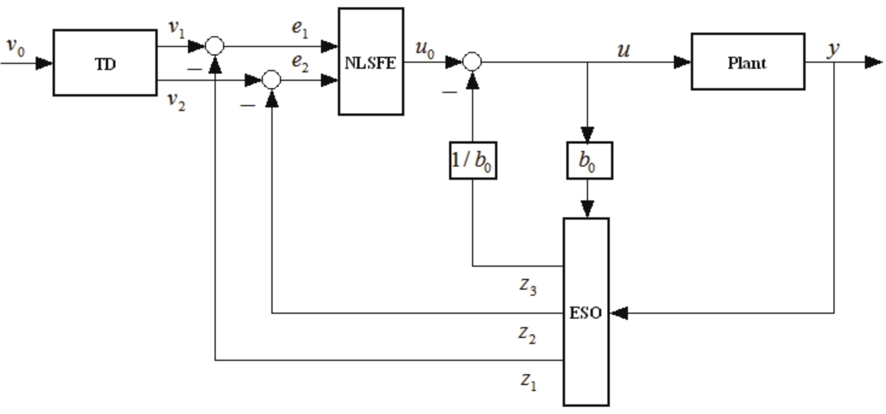
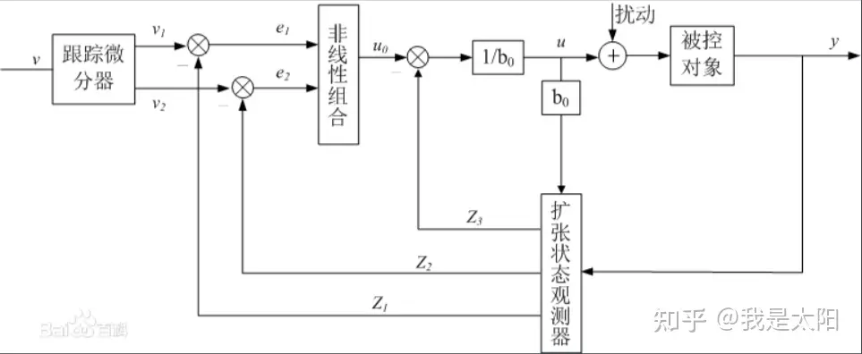
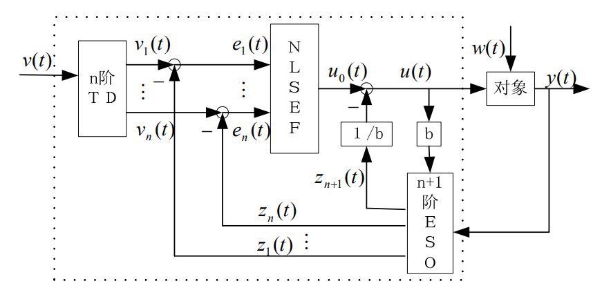

# ADRC控制——自抗扰控制

(实现过程中可能有点小问题，就是把 $w_0$ 错写成 $w_o$，所以这俩是一样的)

为了解决快速性和超调的矛盾，在控制器设计过程中引入了过渡过程，通俗的讲就是输入信号从初始值到目标值并不是阶跃的，而是平滑过渡的，并且这个过渡过程的时间长短是可以调节的。将过渡过程和微分器在一个模块中实现，称为**跟踪-微分器(TD)，**单独的过渡过程和速度规划并没有本质区别。但是TD和速度规划不是一回事，TD将输入过渡和微分器统一为一个模块，它一边尽可能快地跟踪输入信号，同时给出输入信号近似的微分。

自抗扰控制对扰动和不确定性的处理是自抗扰控制最突出的特征，它把作用于被控对象的所有不确定因素都归结为“未知扰动”，而用被控对象的输入输出数据对它进行估计，并给予补偿。“自抗扰”的名称也来源于此，即主动抵抗干扰，不需要直接测量外扰的作用，也不需要实现知道扰动的规律（能知道更好）。构建观测器，利用被控对象的输入、输出和所施加的控制输入来估计作用于系统的总扰动（包括内扰和外扰，可以粗浅地理解为所有的影响因素），实现这一功能的模块被称为**扩展状态观测器**（Extended State Observer，ESO）。这个名字也与观测器的形式十分匹配，因为在设计ESO时，首先构造一个扩张的系统，此系统的阶数比被控对象的阶数高一阶，ESO就是估计扩张系统的状态。观测出系统的总扰动，在设计控制器时首先抵消掉这个扰动，将得到一个标准的串联积分型系统，基于此标准型系统设计控制器时，控制器的形式与PID的形式类型，一般利用误差和误差的微分来构造控制器，这里的误差及其微分是由TD的输出和ESO的输出构造的。韩老师在其专著中给出了常用的几种**非线性状态误差反馈控制律**（Nonlinear State Error Feedback，NLSEF）。

以下的所有形式都是连续型的形式，对于使用离散化的控制，就需要将其离散化

也比较简单：根据导数来计算 $x_{k+1}= T * \frac{dx_k}{dt} + x_k$

### ****************主要模块****************

- 跟踪-微分器 TD
- 扩张状态观测器 ESO
- 状态误差反馈规律 SEF

## LADRC 线性ADRC控制器

被控对象可以有时延，可以有右半平面的零点或极点，但不能在右半平面同时有零点和极点。同时有右半平面的零点和极点，意味着有根轨迹从右半平面出发有回到右半平面，可能一直在右半平面，这样控制器设计是十分困难的。

被控对象的型次要求：对象不含微分器，且型次要求允许控制器含一个积分器。LADRC本身含一个积分器，如果被控对象含微分器，会出现原点的零极点对消。允许控制器含一个积分器是因为LADRC中是一定含有一个积分器的。

### 一阶LADRC

$\frac{dx}{dt} = f(x, t) + b * u$ 即 $\dot{y}=f_1+b*u$

- LTD
    
    状态方程：
    
    $\left\{\begin{aligned}x_1&=y\\e_1 &= x_1 -  v \\ \frac{dx_1}{dt}&=-r * e_1 \\ y&=x_1\\ \end{aligned}\right.$
    
    这个是通过一阶滤波器 $\frac{r}{s + r}$ 推导出来的，只需要更改 $r$ 值， $r$ 值越大到达设定值 $v$ 的时间就越短
    
- LESO
    
    在一阶的ADRC中，LESO是二阶的，具体形式：
    
    $\left\{\begin{aligned}e_2&=&z_{21}-y\\\frac{dz_{21}}{dt}&=&z_{22}-\beta_{1}*e_2+b*u\\\frac{dz_{22}}{dt} &=& -\beta_2*e_2\end{aligned}\right.$
    
    其中参数 $b$ 可以通过被控对象模型中获得， $\beta_1$和 $\beta_2$ 的取值分别是 $2\omega_0$ 和 $\omega^2_0$，其中 $\omega_0$ 是观测器的带宽
    
    其中 $z_1$ 是 $y$ 的跟踪量， $z_2$ 是 $f$ 的跟踪量
    
- LSEF
    
    具体形式：
    
    $\left\{\begin{aligned}u_0&=&kp*(x_1-z_{21})\\u&=&\frac{u_0-z_{22}}{b}\\u&=&u_0-\frac{z_{22}}{b}\end{aligned}\right.$
    
    
    
    这里的 $kp=\omega_c$ 和 PID 是一个意思，但是需要注意的是，这里计算ADRC的输出 $u$ （或者被控对象的输入 $u$）有两种形式，两种形式都可以，最后被控对象等效的都是积分型，第一个等效的是 $\frac{dx}{dt}=u_0$ ，第二个等效的是 $\frac{dx}{dt}=bu_0$。在进行仿真的时候，如果在 LESO 中输入 $u$ 前面有系数 $b$，那么这个图里的 $b_0$哪一项就不需要了，设为1就可以了，只保留 $\frac{1}{b_0}$ 那一项就好了，将 $\frac{1}{b0}$ 设为 $\frac{1}{b}$，如果在 LESO 中，输入 $u$ 前面没有系数 $b$ ，那么这个图里的 $b_0$ 哪一项就设为 $b$，同时将 $\frac{1}{b_0}$ 设为 $\frac{1}{b}$
    
- 具体设计
    
    对于一个系统
    
    $\dot{y} = bu+b_0u-b_0u+f_1$ ⇒ $\dot{y}=b_0u+f$
    
    $\dot{y}=b_0u+f(y,\omega,t)$
    
    设定 $x_2$ 是总扰动 $x_1$ 就是输出
    
    $\left\{\begin{aligned}x_1&=&y\\x_2&=&f\\h&=&\dot{f}\end{aligned}\right.$ ⇒ $\left\{\begin{aligned}\left.\begin{bmatrix}\dot{x_1}\\\dot{x_2}\end{bmatrix}\right.&=&A\left.\begin{bmatrix}x_1\\x_2\end{bmatrix}\right.+Bu+Eh\\y&=&C\left.\begin{bmatrix}x_1\\x_2\end{bmatrix}\right.+Du\end{aligned}\right.$
    
    其中
    
    $A=\left.\begin{bmatrix}0 & 1\\0 &  0\end{bmatrix}\right.$ $B=\left.\begin{bmatrix}b_0\\0\end{bmatrix}\right.$ $C=\left.\begin{bmatrix}1&0\end{bmatrix}\right.$ $D=\left.\begin{bmatrix}0\end{bmatrix}\right.$ $E=\left.\begin{bmatrix}0\\1\end{bmatrix}\right.$
    
    设计线性观测器LESO，其中 $z$ 是状态观测器的输出， $z_1$ 会跟踪 $x_1$ ， $z_2$  会跟踪 $x_2$
    
    $\left\{\begin{aligned}\left.\begin{bmatrix}\dot{z_1}\\\dot{z_2}\end{bmatrix}\right.&=&A\left.\begin{bmatrix}z_1\\z_2\end{bmatrix}\right.+Bu+L(x_1 - z_1)\\\hat{y}&=&C\left.\begin{bmatrix}z_1\\z_2\end{bmatrix}\right.\end{aligned}\right.$
    
    其中L就是状态观测器的两个可调参数，可以调节状态观测器的动态性能，就是收敛的迅速性
    
    $L=\left.\begin{bmatrix}\beta_1\\\beta_2\end{bmatrix}\right.$
    
    带入之后，观测器的形式
    
    $LESO:\left\{\begin{aligned}\left.\begin{bmatrix}\dot{z_1}\\\dot{z_2}\end{bmatrix}\right.&=&\left.\begin{bmatrix}-\beta_1&1\\-\beta_2&0\end{bmatrix}\right.\left.\begin{bmatrix}z_1\\z_2\end{bmatrix}\right.+\left.\begin{bmatrix}b_0&\beta_1\\0&\beta_2\end{bmatrix}\right.\left.\begin{bmatrix}u\\y\end{bmatrix}\right.\\\hat{y}&=&\left.\begin{bmatrix}1&0\\0&1\end{bmatrix}\right.\left.\begin{bmatrix}z_1\\z_2\end{bmatrix}\right.\end{aligned}\right.$
    
    转化为单积分器系统
    
    $\left\{\begin{aligned}z_1→y\\z_2→f\end{aligned}\right.$                $\left\{\begin{aligned}\dot{y}&=&b_0u+f(y, \omega,t)\\u&=&(u_0-z_2)/b_0\end{aligned}\right.$
    
    即
    
    $\dot{y}=b_0(u_0-z_2)/b_0+f(y,\omega,t)=u_0$ ⇒ $u=(u_0-z_2)/b_0$ 可以把系统看作是一个单积分系统，也就是输出是 $u_0$ 的积分
    
    实际上输出就是 $u_0$ 的积分，也就是通过控制被控量的微分来控制系统
    
    设计LSEF就可以是
    
    $LSEF:u_0=\omega_c(r-z_1)$
    
    这里的 $\omega_c$ 就相当于是PID控制器里的 $kp$，也就是用一个简单的 pi 控制器
    
    定义：
    
    $w_o = w_c^2$
    
    $b_1=2w_o$
    
    $b_2=w_o^2$
    
    $r$ 是状态期望
    

### 二阶LADRC

源公式是 $\ddot{y}=f+bu$

二阶系统的被控制对象是

$\left\{\begin{aligned}x_1&=&y\\x_2&=&\dot{y}\\\frac{dx_1}{dt}&=&x_2\\\frac{dx_2}{dt}&=&f(x_1,x_2,t)+b*u\end{aligned}\right.$

- 二阶LTD
    
    二阶LTD是由二阶传递函数 $\frac{r^2}{s^2+2rs+r^2}$ 得来的，形式为：
    
    $\left\{\begin{aligned}\frac{dx_1}{dt}&=&x_2\\\frac{dx_2}{dt}&=&-r^2(x_1-v)-2rx_2\\y&=&x_1\end{aligned}\right.$
    
    其中也是调节参数 $r$ 越大到达设定值的时间就越短
    
- 三阶LESO
    
    $\left\{\begin{aligned}e_2&=&z_{21}-y\\\frac{dz_{21}}{dt}&=&z_{22}-\beta_{21}*e_2\\\frac{dz_{22}}{dt}&=&z_{23}-\beta_{22}*e_2+b_0*u\\\frac{dz_{23}}{dt}&=&-\beta_{23}*e_2\end{aligned}\right.$
    
    其中 $\beta$ 可以从被控对象模型中取到
    
    $\left\{\begin{aligned}\beta_{21}&=&3*\omega_o\\\beta_{22}&=&3*\omega_o^2\\\beta_{23}&=&\omega_o^3\end{aligned}\right.$
    
- 二阶LSEF
    
    $\left\{\begin{aligned}e_{31}&=&x_1-z_{21}\\e_{32}&=&x_2-z_{22}\\u_0&=&\beta_{31}*e_{31}+\beta_{32}*e_{32}\\u&=&\frac{u_0-z_{22}}{b}\end{aligned}\right.$
    
- 控制器的设计流程
    
    $LESO:\left\{\begin{aligned}\left.\begin{bmatrix}\dot{z_{21}}\\\dot{z_{22}}\\\dot{z_{23}}\end{bmatrix}\right.&=&\left.\begin{bmatrix}-\beta_{21}&1&0\\-\beta_{22}&0&1\\-\beta_{23}&0&0\end{bmatrix}\right.\left.\begin{bmatrix}z_{21}\\z_{22}\\z_{23}\end{bmatrix}\right.+\left.\begin{bmatrix}0&\beta_{21}\\b_0&\beta_{22}\\0&\beta_{23}\end{bmatrix}\right.\left.\begin{bmatrix}u\\y\end{bmatrix}\right.\\\hat{y}&=&\left.\begin{bmatrix}1&0&0\\0&1&0\\0&0&1\end{bmatrix}\right.\left.\begin{bmatrix}z_{21}\\z_{22}\\z_{23}\end{bmatrix}\right.\end{aligned}\right.$
    
    其实就是 $\left\{\begin{aligned}z_{21}→y\\z_{22}→\dot{y}\\z_{23}→f\end{aligned}\right.$                $\left\{\begin{aligned}\ddot{y}&=b_0u+f(y, \omega,t)\\u&=\frac{u_0-z_{22}}{b}\end{aligned}\right.$ （→ 表示跟踪）
    
    $LSEF:u_0=\omega_c(r-z_1)$
    
    则 $\ddot{y} = b_0u + f = u_0$
    
    其中
    
    通常选择 $w_0=3\thicksim5w_c$
    
    这适用于状态反馈控制系统，其中 $w_0$ 是根据暂态响应要求，特别是稳定时间规范确定的。控制器设计可以使用平滑的瞬态轮廓，而不是阶跃命令，作为期望的轨迹，允许输出更紧密地跟随。在这种情况下，有两个带宽需要考虑;实际控制回路带宽ωc和瞬态轮廓等效带宽ω¯¯c。因为观察者是根据它跟踪状态的密切程度来评估的，而 $\bar{w_c}$ 比 $w_c$ 更能说明植物状态移动的速度，所以用 $\bar{w_c}$代替(4.17)中的 $w_c$ 。此外，考虑到其他设计问题，如采样延迟，通过仿真和实验找到了更合适的最小 $w_0=5\thicksim10\bar{w_c}$
    
    得到的相当于是对被控制量的二阶导数进行控制，相当于是电流控制位置环
    

## NADRC 非线性ADRC控制器

### 一阶NLADRC

这里前后的 $b$ 是一致的，但是根据线性的 ADRC 的规律，我觉得其实也应该通过 $b_0$ 来控制

- 一阶 NLTD
    
    形式为：
    
    $\left\{\begin{aligned}e_1&=x_1-v\\\frac{dx_1}{dt}&=-r*fal(e_1,\alpha_1,\delta_1)\end{aligned}\right.$
    
    离散化处理之后为
    
    $\left\{\begin{aligned}e_1(k)&=x_1(k)-v(k)\\x_1(k+1)&=-rTfal(e_1(k),\alpha_1,\delta_1)+x_1(k)\end{aligned}\right.$
    
    其中 $fal(e, \alpha,\delta)=\left\{\begin{aligned}&{|e|}^{\alpha}sign(e) && |e| > \delta\\&\frac{e}{\delta^{1-\alpha}} && |e| \leq \delta\end{aligned}\right.$
    
    其中， $fal$函数中的 $\alpha$ 反映了增益的变化率，当 $\alpha>1$，误差又比较大时，该函数增益可能过大，从而导致系统不稳定，通常 $0<\alpha<1$， $\alpha$ 越大，到达设定值的时间就越短。 $\delta$ 是为了避免函数在原点震荡引入的一个很小的正数，可决定函数增益线性变化的区间大小， $\delta$ 越大，则整个函数在作用区间大部分区间内都是线性的，如果 $\delta$ 越小就会使非线性函数更类似于一个开关函数，在原点附近有高频震荡现象
    
- 二阶 NLESO
    
    形式为：
    
    $\left\{\begin{aligned}e_2&=z_{21}-y\\\frac{dz_{21}}{dt}&=z_{22}-\beta_{21}fal(e_2, \alpha_2,\delta_2)+bu\\\frac{dz_{22}}{dt} &= -\beta_{22}fal(e_2, \alpha_2,\delta_2)\end{aligned}\right.$
    
    其中
    
    $\left\{\begin{aligned}\beta_{21}&=2*\omega_0\\\beta_{22}&=\omega_0^2\end{aligned}\right.$
    
    离散化处理之后
    
    $\left\{\begin{aligned}e_2(k)&=z_{21}(k)-y(k)\\z_{21}(k+1)&=T(z_{22}(k)-\beta_{21}fal(e_2,\alpha_2,\delta_2)+bu)+z_{21}(k)\\z_{22}(k+1)&=-T\beta_{22}fal(e_2,\alpha_2,\delta_2)+z_{22}(k)\end{aligned}\right.$
    
    $\left\{\begin{aligned}z_{21}→y\\z_{22}→f\end{aligned}\right.$
    
    输出 $\left\{\begin{aligned}z_{21}(k+1)\\z_{22}(k+1)\end{aligned}\right.$
    
- NLSEF
    
    形式为：
    
    $\left\{\begin{aligned}e_3&=x_1-z_{21}\\u_0&=kp*fal(e_3,\alpha_3,\delta_3)\\u&=\frac{u_0-z_{22}}{b}\\u&=u_0-\frac{z_{22}}{b}\end{aligned}\right.$
    
    输出 $u$
    
    离散化处理：
    
    这里应当是依据于最新状态来计算的
    
    $\left\{\begin{aligned}e_3(k)&=x_1(k)-z_{21}(k)\\u_0(k)&=kp*fal(e_3(k),\alpha_3,\delta_3)\\u(k)&=\frac{u_0(k)-z_{22}(k)}{b}\\u(k)&=u_0(k)-\frac{z_{22}(k)}{b}\end{aligned}\right.$
    
- 控制系统设计

### 二阶 NLADRC

- 二阶 NLTD
    
    $\left\{\begin{aligned}\frac{dx_1}{dt}&=x_2\\\frac{dx_2}{dt}&=-r*sign(x_1-v+\frac{x_2|x_2|}{2r})\end{aligned}\right.$
    
    为了避免在原点附近的颤振，将符号函数  $sign$ 改为线性饱和函数 $sat$ 就得到有效的二阶跟踪一微分器:
    
    $\left\{\begin{aligned}\frac{dx_1}{dt}&=x_2\\\frac{dx_2}{dt}&=-r*sat(x_1-v+\frac{x_2|x_2|}{2r}, \delta)\end{aligned}\right.$
    
    其中
    
    $sat(x, \delta)=\left\{\begin{aligned}&sign(x)&&|x|\geq\delta\\&\frac{x}{\delta}&&|x|<\delta\end{aligned}\right.$
    
    对应的离散化函数为
    
    $\left\{\begin{aligned}x_1(k+1)&=x_1(k)+h*x_2(k)\\x_2(k+1)&=x_2(k)+h*fst(x_1(k)-v(k),x_2(k),r,h1)\end{aligned}\right.$
    
    其中 $r$ 决定跟踪速度，称为速度因子， $h_1$ 对噪声有滤波作用，称为滤波因子
    
    $\left\{\begin{aligned}d&=r*h_1\\d_0&=h_1*d\\y&=x_1(k)+h_1*x_2(k)-v(k)\\a_0&=\sqrt{d^2+8r|y|}\\a&=\left\{\begin{aligned}x_2(k)+\frac{a_0-d}{2}sign(y)&&|y|>d_0\\x_2(k)+\frac{y}{h_1}&&|y|\leq d_0\end{aligned}\right.\\fst(x_1(k)-v(k),x_2,r,h_1)&=\left\{\begin{aligned}-r*sign(a)&&|a|>d\\-r\frac{a}{d}&&|a|\leq d\end{aligned}\right.\end{aligned}\right.$
    
    其中 $r$ 是决定跟踪快慢的参数， $h_1$ 是决定噪声滤波效应的参数
    
    当 $h_1>h$ 时，对于含有噪声的信号，TD滤波器有较好的滤波功能，在确定滤波器参数时，r和ℎ1需要协调调制。r 越大，跟踪信号越快，噪声放大也越厉害，ℎ1越大，滤波效果越好，跟踪信号的相位也损失越大。离散TD能快速、无超调、无颤振的跟踪信号。实际上上面这种 TD 的形式会导致在到达稳态之后输入产生高频震荡，只能说十分的恶心
    
    通过查阅资料（自抗扰控制技术）离散化函数也可以写成这样：
    
    $\left\{\begin{aligned}x_1(k+1)&=x_1(k)+hx_2(k)\\x_2(k+1)&=x_2(k)+h*fhan(x_1(k)-v(k),x_2(k),r,h1)\end{aligned}\right.$
    
    这里的 $h_1$ 就是噪声滤波效应的参数，应当比 $h$ 大一点
    
    $fst(x_1(k)-v(k),x_2,r,h_1)=\left\{\begin{aligned}d&=r*h_1^2\\a_0&=h_1*x_2\\y&=x_1(k)-v(k)+a_0\\a_1&=\sqrt{d(d+8|y|)}\\a_2&=a_0+\frac{a_1-d}{2}sign(y)\\a&=(a_0+y)fsg(y,d)+a_2(1-fsg(y,d))\\fhan&=-r\frac{a}{d}fsg(a,d)-r*sign(a)(1-fsg(a,d))\\fsg(x,d)&=\frac{sign(x+d)-sign(x-d)}{2}\end{aligned}\right.$
    
- 三阶 NLESO
    
    $\left\{\begin{aligned}e_2&=z_{21}-y\\\frac{dz_{21}}{dt}&=z_{22}-\beta_{21}*e_2\\\frac{dz_{22}}{dt}&=z_{23}-\beta_{22}*fal(e_2,\alpha_2,\delta_2)+b*u\\\frac{dz_{23}}{dt}&=-\beta_{23}*fal(e_2,\alpha_3,\delta_3)\end{aligned}\right.$
    
    式中的 $\beta$ 取指方式与二阶的 LESO 相同。同时 $\alpha_3<\alpha_2$， $\delta_2$ 可以取相同值，离散化的时候取 $5T\leq \delta_2\leq 10T$，T 为采样周期
    
    $\left\{\begin{aligned}\beta_{21}&=3*\omega_o\\\beta_{22}&=3*\omega_o^2\\\beta_{23}&=\omega_o^3\end{aligned}\right.$
    
    离散化处理
    
    $\left\{\begin{aligned}z_{21}(k+1)&=h(z_{22}(k)-\beta_{21}*e_2(k)) + z_{21}(k)\\z_{22}(k+1)&=h(z_{23}(k)-\beta_{22}fal(e_2(k),\alpha_2,\delta_2)+bu(k)) + z_{22}(k)\\z_{23}(k+1)&=h(-\beta_{23}*fal(e_2(k),\alpha_3,\delta_3)) + z_{23}(k)\end{aligned}\right.$
    
    其中 $fal(e, \alpha,\delta)=\left\{\begin{aligned}&{|e|}^{\alpha}sign(e) && |e| > \delta\\&\frac{e}{\delta^{1-\alpha}} && |e| \leq \delta\end{aligned}\right.$
    
- NLSEF

    总共有三种非线性的反馈控制规律

    $u_0=\left\{\begin{aligned}&\beta_1e_1+\beta_2e_2\\&\sum_{i=1}^n\beta_ifal(x_i-z_i,\alpha_i,d)\\&-fhan(e_1,e_2,r,h)\\&-fhan(e_1,ce_2,r,h)\end{aligned}\right.$

    其中 $e_0=\int^{t}_{0}{e_1(t)dt}$

    这里的 $u_0$ 有三种形式

    其中

    $fhan(e_1,e_2,r,h)=\left\{\begin{aligned}d&=r*h^2\\a_0&=h_1*e_2\\y&=e_1+a_0\\a_1&=\sqrt{d*(d+8|y|)}\\a_2&=a_0+\frac{a_1-d}{2}sign(y)\\a&=(a_0+y)fsg(y,d)+a_2(1-fsg(y,d))\\fhan&=-r\frac{a}{d}fsg(a,d)-r*sign(a)(1-fsg(a,d))\\fsg(x,d)&=\frac{sign(x+d)-sign(x-d)}{2}\end{aligned}\right.$

    $u$ 也有两种形式

    $u=\left\{\begin{aligned}&\frac{u_0-z_{23}}{b}\\&u_0-\frac{z_{23}}{b}\end{aligned}\right.$

    离散化处理之后

    $\left\{\begin{aligned}u_0&=\left\{\begin{aligned}&\beta_1e_1+\beta_2e_2\\&\sum_{i=1}^n\beta_ifal(x_i-z_i,\alpha_i,d)\\&-fhan(e_1,e_2,r,h)\\&-fhan(e_1,ce_2,r,h)\end{aligned}\right.\\u(k)&=\left\{\begin{aligned}&\frac{u_0(k)-z_{23}(k)}{b}\\&u_0(k)-\frac{z_{23}(k)}{b}\end{aligned}\right.\end{aligned}\right.$

## 参考资料

[[自抗扰控制-低阶LADRC与PID](https://zhuanlan.zhihu.com/p/585324684)]

[[自抗扰控制-ADRC](https://zhuanlan.zhihu.com/p/664345718)]

[[自抗扰控制理论](https://zhuanlan.zhihu.com/p/115283894)]

[[From PID to Active Disturbance Rejection Control](https://ieeexplore.ieee.org/document/4796887)]

[自抗扰控制技术——韩京清](./非线性自抗扰控制技术——韩京清.pdf)