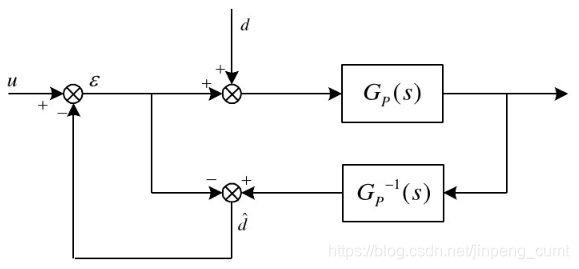
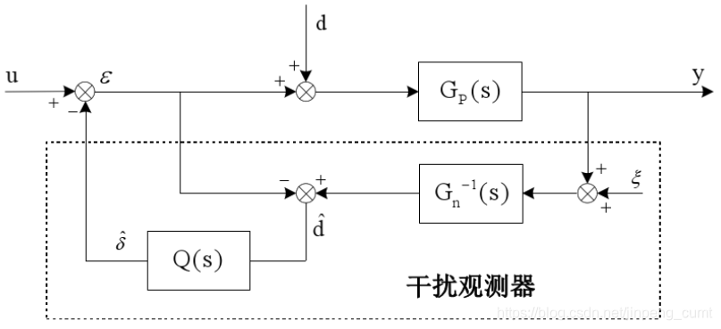
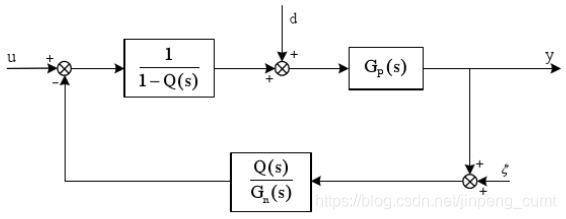
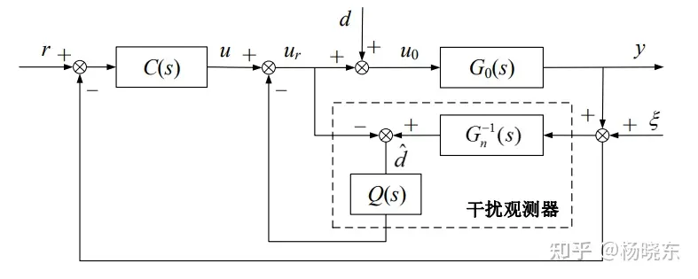

# DOB扰动观测器

[GitHub - C25177/modelControl](https://github.com/C25177/modelControl)

### 前言——一些用到的概念

- 最小相位系统：对于FIR系统（没有极点），如果系统函数的所有零点都位于单位圆内，则称该系统为最小相位系统。如果系统函数的所有零点都位于单位圆外，则称该系统为最大相位系统。如果一部分零点位于单位圆内，一部分零点位于单位圆外，则称该系统为混合相位系统或非最小相位系统。对于IIR系统（存在极点），如果系统函数的所有零点和极点都在单位圆内，则称该系统为最小相位系统。也就是

相频特性φ ( w ) \varphi (w)φ(w)在w = 0 w=0w=0和w = π w=\piw=π之间经历的净相位变化为零
————————————————

- 最小相位系统主要特性
    - 最小相位系统是因果且稳定的
    - 其逆系统也是因果且稳定的
    - 在所有具有相同幅频响应的零-极点系统中，最小相位系统的群时延最小

### 基本原理

基本思想就是将外部扰动以及模型参数变化造成的实际模型与理想模型输出的差异统统等效为控制输入，即观测出等效干扰，在控制中引入等量的补偿，实现对干扰完全抑制。干扰观测器的基本思想，系统实际控制输入与计算输入（由系统标称模型计算得到）的差值，来得到扰动和不确定性的估计

### 具体公式

图中的 $G_p(s)$ 为对象的传递函数， $\hat{d}$ 为等效干扰， $d$ 为观测干扰， $u$ 为控制输入。在图中可知，等效干扰的估计值为

$$
\hat{d}=(\varepsilon+d)G_p(s)G_p^{-1}(s)-\varepsilon=d
$$

上述公式可以实现对干扰的准确估计和补偿，但是对于实际的物理系统，上述公式还存在着问题

### 存在问题

1. 通常情况下， $G_p(s)$ 的相对阶不为 0，物理上的逆不可实现
2. 控制系统的传递函数的精确模型无法得到
3. 考虑测量灶神给的影响，上述方法的控制性能将下降

### 解决方法

对于上述问题的一个解决办法是在 $\hat{d}$ 之后串联一个低通滤波器，并且使用系统的理想模型的逆 $G_n^{-1}(s)$ 来替代 $G_p^{-1}$ ，得到下图控制系统，其中 $\xi$ 为观测噪声

从图中可知

$$
\hat{d}=(\varepsilon+d)G_p(s)G_n^{-1}(s)Q(s)-\varepsilon Q(s)=d\\=\varepsilon(G_n^{-1}(s)Q(s)G_p(s)-Q(s))+d(G_n^{-1}Q(s)G_p(s)
$$

则从 $u$ 到 $y$ 的传递函数为

$$
G_{uy}(s)=\frac{G_p(s)}{1-[Q(s)-G^{-1}_n(s)Q(s)G_p(s)]}=\frac{\frac{G_p(s)}{1-Q(s)}}{1+\frac{Q(s)}{G_n(s)}\frac{G_p(s)}{1-Q(s)}}
$$

上述框图可等价为

根据上图可以得到干扰观测器输入输出关系为

$$
y=G_{uy}u+G_{dy}d+G_{\xi y}\xi
$$

其中

$$
G_{uy}(s)=\frac{G_p(s)G_n(s)}{G_n(s)-G_n(s)Q(s)+Q(s)G_p(s)}\\G_{dy}(s)=\frac{G_p(s)G_n(s)-Q(s)G_p(s)G_n(s)}{G_n(s)-G_n(s)Q(s)+Q(s)G_p(s)}\\G_{\xi y}(s)=\frac{G_p(s)Q(s)}{G_n(s)-G_n(s)Q(s)+Q(s)G_p(s)}
$$

其中对 $Q(s)$ 需要很高的要求

1. 为使得 $Q(s)G_n^{-1}$ 正则， $Q(s)$ 的相对阶应不小于 $G_n(s)$ 的相对阶
2. $Q(s)$ 带宽的设计是在干扰观测器的鲁棒稳定性和干扰抑制能力之间的折中
3. 在低频段 $Q(s)=1$ ，在高频段 $Q(s)=0$

一般来说，实际系统的外部干扰和跟踪参考输入主要是低频信号，而测量噪声主要是在高频段，因此理想的 $Q(s)$ 是在低频时接近于 1，以保证 $G_{dy}(s)\rightarrow0$ ，从而抑制对象输入端干扰。同时 $Q(s)$ 在高频段应该接近于 0，以保证 $G_{\xi y}\rightarrow 0$ ，从而能够抑制对象输出端高频噪声，所以需要 $Q(s)$ 为一个低通滤波器

根据上述条件下，在低频段， $Q(s)\rightarrow 1$

$$
G_{uy}(s)=G_n(s)\\G_{dy}(s)=0\\G_{\xi y}(s)=1
$$

也就是在低频段，干扰观测器仍使得实际对象的响应与名义模型的响应一致，可以实现对低频段的有效补偿，从而保证有良好的鲁棒性。上述中的 $G_{dy}=0$ 说明感染观测器对于 $Q(s)$ 频带内的低频干扰有完全的抑制能力。但是 $G_{\xi y}=1$ 说明干扰观测器对于低频测量噪声十分敏感，所以在使用中需要尽量减少观测中的低频噪声

在高频段， $Q(s)=0$

$$
G_{uy}(s)=G_p(s)\\G_{dy}(s)=G_p(s)\\G_{\xi y}(s)=0
$$

上式说明在高频段中 $G_{\xi y}(s)=0$ 说明干扰观测器对测量噪声不敏感，可以实现对高频噪声的有效滤除，但对于对象参数的变动和外部干扰没有任何抑制作用，通过上述分析可见，采用地通滤波器 $Q(s)$ 设计可以实现对低频干扰信号的有效补偿和高频噪声的有效滤除

### 鲁棒性分析

通常来说被控对象的名义模型可以选择为二阶模型，而低通滤波器可以选择为如下形式

$$
Q(s)=\frac{3\tau s+1}{\tau^3 s^3+3\tau^2s^2+3\tau s+1}
$$

其中 $\tau$ 为时间常数，则该低通滤波器的相对阶数为 2。上式中的滤波器的截止频率为 $w_c=\frac{1}{\tau}$ 

低频下 $|Q(s)|\rightarrow 1$ ，高频下 $|Q(s)|\rightarrow 0$ ，因此干扰观测器的作用频率将正比于 $w_c$ ，但是不能任意减小 $\tau$ 以提高观测器的作用频率，是因为整个系统的鲁棒稳定性也将取决于 $\tau$ 。如果真实的被控对象的不确定性用乘性摄动来表示，也就是

$$
G_p(s)=G_n(s)(1+\Delta (s))
$$

其中 $\Delta(s)$ 表示系统稳定性的乘性不确定性。根据小增益定理，干扰观测器的鲁棒稳定性条件为

$$
\lVert\Delta(s)Q(s)\rVert_\infty<1
$$

通常系统的乘性不确定性在高频段增益较大，所以低通滤波器在高频段需要有较大的衰减，且带宽不能过大。所以**低通滤波器的带宽需要在干扰观测器的抑制干扰能力与鲁棒稳定性之间进行折中**

### 基于干扰观测器的闭环控制系统分析

通过采用干扰观测器，从控制输入 $u$ 到系统输出 $y$ 的传递函数可以近似为名义模型 $G_n(s)$ ，因此名义模型 $G_n(s)$ 可以设计外环控制器 $C(s)$ 以实现的控制性能

$$
G_{ry}(s)=\frac{C(s)G_p(s)G_n(s)}{G_n(s)(1+C(s)G_p(s))+(G_p(s)-G_n(s))Q(s)}\\G_{dy}(s)=\frac{G_p(s)G_n(s)-Q(s)G_p(s)G_n(s)}{G_n(s)(1+C(s)G_p(s))+(G_p(s)-G_n(s))Q(s)}\\G_{\xi y}(s)=\frac{G_p(s)(C(s)G_n(s)+Q(s))}{G_n(s)(1+C(s)G_p(s))+(G_p(s)-G_n(s))Q(s)}
$$

则整个闭环系统的特征方程为

$$
G_n(s)(1+C(s)G_p(s))+(G_p(s)-G_n(s))Q(s)=0
$$

当名义模型 $G_n(s)$ 与真实模型 $G_p(s)$ 之间不存在任何误差时，则上述中的特征方程为

$$
1+C(s)G_p(s)=0
$$

与系统中不含干扰观测器内环时的特征方程一致，所以在名义模型与真实模型之间没有误差时，只要外环控制器 $C(s)$ 能够使系统稳定， 整个基于干扰观测器的闭环控制系统仍是稳定的，即干扰观测器内环不影响系统稳定性。

分析系统的鲁棒稳定性条件。假设真实被控对象具有乘性不确定性形式。若系统名义模型 $G_n(s)$ 为非最小相位系统， 且外环控制器 $C(s)$ 可以镇定 $G_n(s)$ ，则基于干扰观测器的整个闭环控制系统保持鲁棒稳定的充分条件是

$$
|\Delta(s)|<|\frac{1+C(s)G_n(s)}{Q(s)+C(s)G_n(s)}|
$$

从上述条件可知，在低频段 $Q(s)\approx1$ ，应该满足 $|\Delta(s)|<1$ ，要求低频段名义模型的建模误差不应过大，同时由于名义模型通常在高频段会有较大的不确定性，所以高频段 $Q(s)$ 的增益应尽量小

### 参考

[聊聊控制领域的干扰观测器(DOB) - 知乎 (zhihu.com)](https://zhuanlan.zhihu.com/p/504256899)

[【控制理论】干扰观测控制读书笔记（Disturbance Observer-Based on control)_干扰观测器里能带控制量吗-CSDN博客](https://blog.csdn.net/xiaohejiaoyiya/article/details/104077561)

[非线性控制5——扰动观测器-CSDN博客](https://blog.csdn.net/jinpeng_cumt/article/details/107058723)