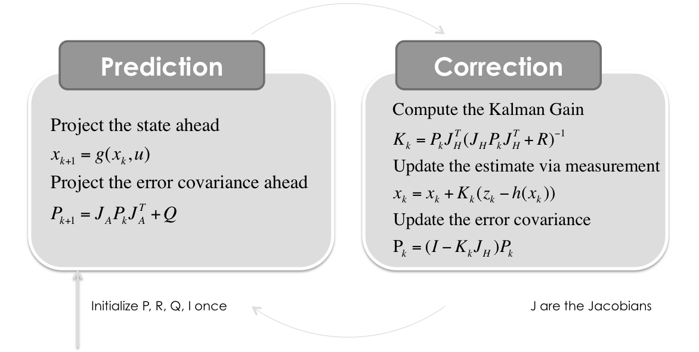
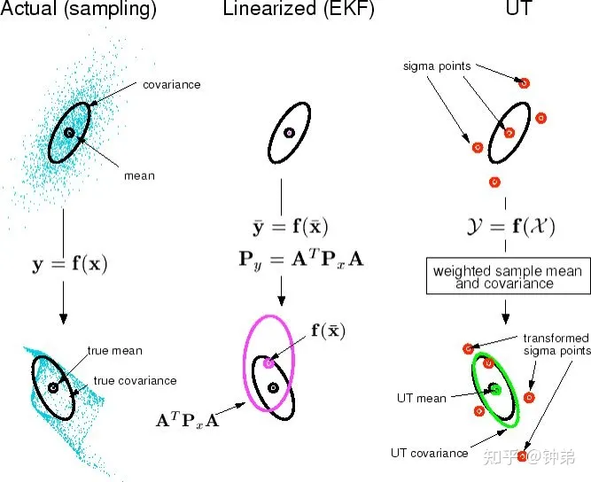

# KF卡尔曼滤波

## 卡尔曼滤波 KF

### 公式

$$
\hat{x}_{k|k-1}=F_k\hat{x}_{k-1|k-1}\\P_{k|k-1}=F_kP_{k-1|k-1}F_k^T+Q_k\\K_k=P_{k|k-1}H_k^T(H_kP_{k|k-1}H_k^T+R_k)^{-1}\\\hat{x}_{k|k}=\hat{x}_{k|k-1}+K_k(z_k-H_k\hat{x}_{k|k-1})\\P_{k|k}=(I-K_kH_k)P_{k|k-1}
$$

### 基本假设

卡尔曼滤波模型假设k时刻的真实状态是从（k − 1）时刻的状态演化而来

**状态估计方程**

$$
x_k=F_kx_{k-1}+B_ku_k+w_k
$$

其中

- $F_k$ 是状态变换模型（矩阵/向量），运动学一般是矩阵（状态转移矩阵）
- $B_k$ 是作用在控制器向量 $u_k$ 上的输入-控制模型，一般运动学中没有这一项，因对于检测的目标的是无法测量其内部的控制量的，所以简化为0
- $w_k-N(0,Q_k)$ 是过程噪声。均值为 0， $x_k$ 对应的就是高斯分布的均值，因此这项可以简化为 0

**状态估计转移方程**

$$
z_k=H_kx_k+v_k
$$

表示 k 时刻真实 $x_k$ 的一个测量

其中

- $H_k$ 为观测模型（观测矩阵），它把真实空间状态映射成观测空间状态
- $v_k-N(0,R_k)$ 是观测噪声

初始状态以及每一时刻的噪声 $x_0,w_1,…,w_k,v_1,…v_k$ 都被认为是相互独立的

**小结**

从以上出发，可以计算相应的协方差矩阵，这个也是公式推导的主要部分。

### 预测

$$
\hat{x}_{k|k-1}=F_k\hat{x}_{k-1|k-1}
$$

**估计状态方程**，表示预测下一步状态。

其中

- $\hat{x}_{k|k-1}$ 表示 k-1 时刻对 k 时刻的状态预测
- $\hat{x}_{k-1|k-1}$ 表示在 k-1 时刻对 k-1 时刻的状态估计
- $F_k$ 为状态估计矩阵

$$
P_{k|k-1}=F_kP_{k-1|k-1}F_k^T+Q_k
$$

**预测二估计协方差方程**，预测误差方差，计算先验概率

其中

- $P_{k-1|k-1}$ 表示 k-1 时刻的后验估计误差协方差矩阵，度量估计值的精确程度
- $P_{k|k-1}$ 表示 k-1 时刻到 k 时刻的估计误差协方差矩阵
- $Q_k$ 表示过程噪声协方差矩阵，越大说明约不相信预测。实际工程中可以自行调参（$Q_k=cov(Z, Z)$），也可以自适应AKF

### **更新**

$$
K_k=P_{k|k-1}H_k^T(H_kP_{k|k-1}H_k^T+R_k)^{-1}
$$

************************************卡尔曼增益方程************************************

其中

- $K_k$ 为最优卡尔曼增益
- $R_k$ 为测量噪声协方差矩阵，越大说明越不相信观测。实际测量噪声由厂家提供，或者自己调参，也可自适应AKF

$$
\hat{x}_{k|k}=\hat{x}_{k|k-1}+K_k(z_k-H_k\hat{x}_{k|k-1})
$$

**更新状态估计方程——最终滤波的效果**

可以使用测量残差来简化表达公式，即

$$
\hat{y}=z_k-H_k\hat{x}_{k|k-1}\\S_k=cov(\hat{y})=H_kP_{k|k-1}H_k^T+R_k
$$

即卡尔曼增益可以简化为

$$
K_k=P_{k|k-1}H_k^TS_k^{-1}
$$

状态估计更新可以简化为

$$
\hat{x}_{k|k}=\hat{x}_{k|k-1}+K_k\hat{y}
$$

其中 $cov(x)$ 求解矩阵的协方差矩阵，若 X 大小为 $M \times N$*，则* $cov(X)$ *大小 为* $N\times N$ **的矩阵。 $cov(X)$ 的第 $(i,j)$ 个元素等于 X 的第 i 列向量与第 j 列向量的方差，即 $C(Xi,Xj)$。

$$
P_{k|k}=(I-K_kH_k)P_{k|k-1}
$$

**更新估计协方差——得到后验概率**

### 公式推导

首先 $Q_k$ 和 $R_k$ 一般为固定值，高级卡尔曼滤波可以自适应

$$
Q_k=cov(w_k)=E(w_kw_k^T)\\R_k=cov(v_k)=E(v_kv^T_k)\\P_{k|k-1}=cov(x_k-\hat{x}_{k|k-1})=E((x_k-\hat{x}_{k|k-1})(x_k-\hat{x}_{k|k-1})^T)\\P_{k|k}=cov(x_k-\hat{x}_{k|k})=E((x_k-\hat{x}_{k|k})(x_k-\hat{x}_{k|k})^T)\\S_k=cov(\hat{y})=cov(z_k-H_k\hat{x}_{k|k-1})
$$

从状态估计方程推导 $P_{k|k-1}$

$$
P_{k|k}=cov(x_k-\hat{x}_{k|k})\\=cov(x_k-\hat{x}_{k|k-1}-K_k(z_k-H_k\hat{x}_{k|k-1}))\\=cov(x_k-\hat{x}_{k|k-1}-K_k(H_kx_k+v_k-H_k\hat{x}_{k|k-1}))\\=cov((I-K_kH_k)(x_k-\hat{x}_{k|k-1})-K_kv_k)\\=cov((I-K_kH_k)(x_k-\hat{x}_{k|k-1})+cov(K_kv_k)\\=(I-K_kH_k)cov(x_k-\hat{x}_{k|k-1})(I-K_kH_k)^T+K_kcov(v_k)K_k^T\\=(I-K_kH_k)P_{k|k-1}(I-K_kH_k)^T+K_kR_kK_k^T
$$

这一公式对任何卡尔曼增益 $K_k$ 都成立，如果 $K_k$ 是最优卡尔曼增益，则可以进一步简化

**推导最优卡尔曼增益** $K_k$

可以根据上式推导最优卡尔曼增益

卡尔曼滤波器是最小均方误差估计器，后验状态误差估计是指 $P_{k|k}=cov(x_k-\hat{x}_{k|k})$，当 $P_{k|k}$ 矩阵的均方误差为最小时，即可求出最优卡尔曼增益

矩阵的均方误差为矩阵的迹。求矩阵的最小均方误差，即是求矩阵的迹的最小值，对矩阵的迹求导，导数为0时，迹最小。其中协方差 $P_{k|k}$ 是对称矩阵

$$
P_{k|k}=(I-K_kH_k)P_{k|k-1}(I-K_kH_k)^T+K_kR_kK_k^T\\=P_{k|k-1}-K_kH_kP_{k|k-1}-P_{k|k-1}(K_kH_k)^T+K_k(H_kP_{k|k-1}H_k^T+R_k)K_k^T
$$

求解该矩阵的迹

$$
tr(P_{k|k})=tr(P_{k|k-1}-K_kH_kP_{k|k-1}-P_{k|k-1}(K_kH_k)^T+K_k(H_kP_{k|k-1}H_k^T+R_k)K_k^T)\\=tr(P_{k|k-1})-2tr(K_kH_kP_{k|k-1})+tr(K_k(H_kP_{k|k-1}H_k^T+R_k)K_k^T)
$$

上式对 $K_k$ 求导

$$
\frac{d~tr(P_{k|k})}{d~K_k}=\frac{d[tr(P_{k|k-1})-2tr(K_kH_kP_{k|k-1})+tr(K_k(H_kP_{k|k-1}H_k^T+R_k)K_k^T)]}{d~K_k}\\=-2(H_kP_{k|k-1})^T+2K_k(H_kP_{k|k-1}H_k^T+R_k)
$$

当导数为 0 时取极值，即

$$
-2(H_kP_{k|k-1})^T+2K_k(H_kP_{k|k-1}H_k^T+R_k)=0
$$

得

$$
K_k=(H_kP_{k|k-1})^T(H_kP_{k|k-1}H_k^T+R_k)^{-1}
$$

令

$$
S_kH_kP_{k|k-1}H_k^T+R_k
$$

得

$$
K_k=P_{k|k-1}H_k^TS_k^{-1}
$$

对该矩阵的迹求二阶导

$$
\frac{d~tr^2(P_{k|k})}{d~K_k^2}=2(H_kP_{k|k-1}H_k^{-1}+R_k)^T
$$

由于 $R_k$ 表示 $v_k$ 的协方差矩阵，所以其一定是正定阵，因此该矩阵是正定阵，因此此时求出其迹的最小值

****最优卡尔曼增益化简**** $P_{k|k}$

从上式化简得到

$$
K_kS_k=(H_kP_{k|k-1})^T\\K_kS_kK_k^T=(H_kP_{k|k-1})^TK_k^T=P_{k|k-1}(K_kH_k)^T
$$

带入其中得

$$
P_{k|k}=P_{k|k-1}-K_kH_kP_{k|k-1}-P_{k|k-1}(K_kH_k)^T+K_k(H_kP_{k|k-1}H_k^T+R_k)K_k^T\\=P_{k|k-1}-K_kH_kP_{k|k-1}-P_{k|k-1}(K_kH_k)^T+K_kS_kK_k^T\\=(I-K_kH_k)P_{k|k-1}
$$

该简化式 $P_{k|k}=(I-K_kH_k)P_{k|k-1}$ 只能在最优卡尔曼增益时才成立。如果算术精度总是很低而导致数值稳定性出现问题，或者特意使用非最优卡尔曼增益，则必须使用上面未简化的后验误差协方差公式 $P_{k|k}=(I-K_kH_k)P_{k|k-1}(I-K_kH_k)^T+K_kR_kK_k^T$

## 自适应卡尔曼滤波 AKF

首先列出系统方程

$$
X_k=AX_{k-1}+Cu_k+Bw_k\\Y_k=CX_k+v_k
$$

其中

$$
X_k 表示状态量\\Y_k表示输出量\\u_k表示输入量\\w_k，v_k 为噪声
$$

$$
E[w_k]=q_k\\E[w_kw_k^T]=Q_k\delta_{tp}\\E[v_k]=r_k\\E[v_kv_k^T]=R_k\delta_{tp}
$$

其中 $Q(t),R(t),q(t),r(t)$ 将在后续进行更新

### 具体过程

1. ************预测方程************

$$
\hat{X}_{k|k-1}=A\hat{X}_{k-1|k-1}+Cu_{k-1}+B\overline{q}_{k-1}
$$

其中 $\overline{q}_{k-1}$ 表示预测误差矩阵

2. **预测均方差误差方程**

$$
P_{k|k-1}=AP_{k-1|k-1}A^T+B\overline{Q}_{k-1}B^T
$$

其中 $\overline{Q}_{k-1}$ 表示过程噪声协方差矩阵，Q越大表示预测的协方差就越大，对预测的不信任

3. ************************************************更新滤波增益方程************************************************

$$
K_k=P_{k|k-1}C^T(CP_{k|k-1}C^T+\overline{R}_{k-1})^{-1}
$$

其中 $\overline{R}_{k-1}$ 是测量噪声协方差矩阵，R越大表示观测的协方差就越大，对观测不信任

4. ****************计算残差****************

$$
\varepsilon_k=Y_k-C\hat{X}_{k|k-1}-\overline{r}_{k-1}
$$

其中 $\overline{r}_{k-1}$ 是观测误差矩阵

5. **************状态估计**************

$$
\hat{X}_{k|k}=\hat{X}_{k|k-1}+K_k\varepsilon_k
$$

和卡尔曼滤波器的对应公式是一样的

6. **********************************均方差误差方程**********************************

$$
P_{k|k}=(I-K_kC)P_{k|k-1}
$$

和卡尔曼滤波器的对应公式是一样的

******更新****** $q_k, Q_k, r_k, R_k$

7. **************************************计算加权系数**************************************

$$
d(t)=\frac{1-b}{1-b^{t+1}}~~~0<b<1
$$

随着时间的推移， $d(t)→1-b$

$$
d(t)=\frac{1}{t}
$$

随着时间推移， $d(t)→0$，当 $d(t)=0$ 时，还原为普通的卡尔曼滤波器

8. ********更新******** $\overline{q}_k, \overline{Q}_k,\overline{r}_k,\overline{R}_k$ 

$$
\overline{q}_k=(1-d(k-1))\overline{q}_{k-1}+d(k-1)(\hat{X}_{k|k}-A\hat{X}_{k-1|k-1})\\\overline{Q}_k=(1-d(k-1))\overline{Q}_{k-1}+d(k-1)(K_k\varepsilon_k\varepsilon_k^TK_k^T+P_{k|k}-AP_{k-1|k-1}A^T)\\\overline{r}_k=(1-d(k-1))\overline{r}_{k-1}+d(k-1)(Y_k-C\hat{X}_{k|k-1})\\\overline{R}_{k}=(1-d(k-1))\overline{R}_{k-1}-d(k-1)(\varepsilon_k\varepsilon_k^T-CP_{k|k-1}C^T)
$$

## 扩展卡尔曼滤波 EKF

用来解决非线性问题，如极坐标系的雷达，观测到的式径向距离和角度，这是观测矩阵 H 就是非线性的函数。

EKF 与 KF 最主要的区别就是转换模型和观测模型可以是非线性的，可以使用泰勒展开式替换为线性函数，两个协方差矩阵 P 和 H 要使用雅各比矩阵计算每个状态量的一阶偏导

因为主要是状态估计方程和状态估计转移方程的两个地方有些区别，所以 EKF 协方差矩阵的公式推导还是跟 KF 一样的

### 预测

$$
\hat{x}_{k|k-1}=f(\hat{x}_{k-1|k-1},u_k,0)\\P_{k|k-1}=J_FP_{k-1|k-1}J_F^T+Q_k
$$

### 使用 Jacobians 矩阵更新模型

过程模型(矩阵)和测量模型(矩阵)与 KF 有所区别，需要进行雅各比矩阵求导运算

$$
J_F=\frac{\partial f}{\partial x}|_{\hat{x}_{k-1|k-1}, u_k}\\J_H=\frac{\partial h}{\partial x}|_{\hat{x}_{k|k-1}}
$$

### 更新

$$
\hat{y}_k=z_k-h(\hat{x}_{k|k-1}, 0)\\S_k=J_HP_{k|k-1}H_k^T+R_k\\K_k=P_{k|k-1}J_H^TS_k^{-1}\\\hat{x}_{k|k}=\hat{x}_{k|k-1}+K_k\hat{y}\\P_{k|k}=(I-K_kJ_H)P_{k|k-1}
$$

### 恒定转弯率和速度模型（Constant Turn Rate and Velocity——CTRV）

状态量为

$$
X=\begin{bmatrix}x\\y\\v\\\theta\\\omega\end{bmatrix}
$$

状态方程为

$$
X_{k+1}=X_k+\begin{bmatrix}\int_{t_k}^{t_{k+1}}{v(t)cos(\theta(t))}dt\\\int_{t_k}^{t_{k+1}}{v(t)sin(\theta(t))}dt\\0\\\omega \Delta t\\0\end{bmatrix}
$$

其中在某一时刻将速度近似于常量，同时角速度也近似于常量。

对上式进行简化

$$
\int_{t_k}^{t_{k+1}}{v(t)cos(\theta(t))}dt=v_k\int_{t_k}^{t_{k+1}}{cos(\theta_k+\omega (t-t_k))}dt=\frac{v_k}{\omega}[sin(\omega \Delta + \theta)- sin(\theta)]\\\int_{t_k}^{t_{k+1}}{v(t)sin(\theta(t))}dt=v_k\int_{t_k}^{t_{k+1}}{sin(\theta_k+\omega (t-t_k))}dt=\frac{v_k}{\omega}[-cos(\omega \Delta + \theta)+ cos(\theta)]
$$

则，上式的最终状态方程为

$$
X_{k+1}=X_k+\begin{bmatrix}\frac{v_k}{\omega}[sin(\omega \Delta + \theta)- sin(\theta)]\\\frac{v_k}{\omega}[-cos(\omega \Delta + \theta)+ cos(\theta)]\\0\\\omega \Delta t\\0\end{bmatrix}=\begin{bmatrix}x_k+\frac{v_k}{\omega}[sin(\omega \Delta + \theta)- sin(\theta)]\\y_k+\frac{v_k}{\omega}[-cos(\omega \Delta + \theta)+ cos(\theta)]\\v_k\\\omega \Delta t+\theta\\\omega\end{bmatrix}
$$

对其中每个状态量求偏导得到雅各比矩阵 $J_F$

$$
J_F=\begin{bmatrix}1&0&\frac{1}{\omega}[sin(\omega \Delta t+\theta)-sin(\theta)&\frac{v_k}{\omega}[cos(\omega \Delta t+\theta)-cos(\theta)&\frac{v_k\Delta t}{\omega}cos(\omega \Delta t+\theta)-\frac{v_k}{\omega^2}[sin(\omega \Delta t+\theta)-sin(\theta)]\\0&1&\frac{1}{\omega}[-cos(\omega \Delta t+\theta)+cos(\theta)&\frac{v_k}{\omega}[sin(\omega \Delta t+\theta)-sin(\theta)&\frac{v_k\Delta t}{\omega}sin(\omega \Delta t+\theta)-\frac{v_k}{\omega^2}[-cos(\omega \Delta t+\theta)+cos(\theta)]\\0&0&1&0&0\\0&0&0&1&0\\0&0&0&0&1\end{bmatrix}
$$

对于观测矩阵，如果是线性的，不用做计算。如果是非线性的，同样可以使用求偏导数的方式计算出雅各比矩阵 $J_H$

假设传感器是毫米波雷达观，且观测量是

$$
z_k=\begin{bmatrix}\rho_k\\\theta_k\\\dot{\rho}_k\end{bmatrix}=\begin{bmatrix}\sqrt{x_k^2+y_k^2}\\arctan(\frac{y_k}{x_k})\\\frac{v_xx_k+v_yy_k}{\sqrt{x_k^2+y_k^2}}\end{bmatrix}=\begin{bmatrix}\sqrt{x_k^2+y_k^2}\\arctan(\frac{y_k}{x_k})\\\frac{v_xx_kcos(\theta)+v_yy_ksin(\theta)}{\sqrt{x_k^2+y_k^2}}\end{bmatrix}
$$

上式对状态方程每个状态量求偏导，得到雅各比矩阵，即观测矩阵 $J_H$ 为

$$
J_H=\begin{bmatrix}\frac{x}{\sqrt{x^2+y^2}}&\frac{y}{\sqrt{x^2+y^2}}&0&0&0\\-\frac{y}{x^2+y^2}&\frac{x}{x^2+y^2}&0&0&0\\\frac{y(vcos(\theta)y-vsin(\theta)x)}{(x^2+y^2)^{\frac{3}{2}}}&\frac{x(vsin(\theta)x-vcos(\theta)y)}{(x^2+y^2)^{\frac{3}{2}}}&\frac{xcos(\theta)+ysin(\theta)}{\sqrt{x^2+y^2}}&\frac{vcos(\theta)y-vsin(\theta)x}{\sqrt{x^2+y^2}}&0\end{bmatrix}
$$

******************************Q矩阵计算******************************

对于 CTRV，假设直线加速度 $a_a$ 和偏航角加速度 $a_{\omega}$ 为常数，但是实际过程中会有噪声，因此 CTRV 的模型过程噪声主要来自于 $a_a$ 和 $a_\omega$。假设该模型噪声都符合高斯分布，即

$$
a_a\sim N(0,\sigma_a^2)\\a_\omega\sim N(0,\sigma_\omega^2)
$$

则这两个加速度对状态量的预测噪声为

$$
w=\begin{bmatrix}\frac{\Delta t^2cos(\theta)a_a}{2}\\\frac{\Delta t^2sin(\theta)a_a}{2}\\\Delta t a_a\\\frac{\Delta t^2a_\omega}{2}\\\Delta t a_\omega\end{bmatrix}=\begin{bmatrix}\frac{\Delta t^2cos(\theta)}{2}&0\\\frac{\Delta t^2sin(\theta)}{2}&0\\\Delta t&0\\0&\frac{\Delta t^2}{2}\\0&\Delta t \end{bmatrix}\begin{bmatrix}a_a\\a_\omega \end{bmatrix}=Gu
$$

则

$$
Q=cov(w)=E(ww^T)=GE(uu^T)G^T=G\begin{bmatrix}\sigma_a^2&0\\0&\sigma_\omega^2 \end{bmatrix}G^T
$$

带入之后得

$$
Q=\begin{bmatrix}\frac{T^4\sigma_a^2cos^2(\theta)}{4}&\frac{T^4\sigma_a^2cos(\theta)sin(\theta)}{4}&\frac{T^3\sigma_a^2cos(\theta)}{2}&0&0\\\frac{T^4\sigma_a^2sin(\theta)cos(\theta)}{4}&\frac{T^4\sigma_a^2sin^2(\theta)}{4}&\frac{T^3\sigma_a^2sin(\theta)}{2}&0&0\\\frac{T^3\sigma_a^2cos(\theta)}{2}&\frac{T^3\sigma_a^2sin(\theta)}{2}&T^2\sigma_a^2&0&0\\0&0&0&\frac{T^4\sigma_a^2}{4}&\frac{T^3\sigma_\omega^2}{2}\\0&0&0&\frac{T^3\sigma_\omega^2}{2}&T^2\sigma_\omega^2\end{bmatrix}
$$

常用的**CV模型**的状态量为

$$
X=\begin{bmatrix}x\\y\\v_x\\v_y\end{bmatrix}
$$

其状态方程为

$$
X_{k+1}=X_k+\begin{bmatrix}v_x\Delta t\\v_y\Delta t\\0\\0\end{bmatrix}=\begin{bmatrix}x_k+v_x\Delta t\\y_k+v_y\Delta t\\v_x\\v_y\end{bmatrix}
$$

该式子对状态量中的每个参数求偏导，得到 $J_F$

$$
J_F=\begin{bmatrix}1&0&\Delta t&0\\0&1&0&\Delta t\\0&0&1&0\\0&0&0&1\end{bmatrix}
$$

如果假设观测量为

$$
z_k=\begin{bmatrix}\rho_k\\\theta_k\\\dot{\rho}_k\end{bmatrix}=\begin{bmatrix}\sqrt{x_k^2+y_k^2}\\arctan(\frac{y_k}{x_k})\\\frac{v_xx_k+v_yy_k}{\sqrt{x_k^2+y_k^2}}\end{bmatrix}
$$

该式子对系统状态量中每个参数求偏导，得到 $J_H$

$$
J_H=\begin{bmatrix}\frac{x_k}{\sqrt{x_k^2+y_k^2}}&\frac{y_k}{\sqrt{x_k^2+y_k^2}}&0&0\\-\frac{y_k}{x_k^2+y_K^2}&\frac{x_k}{x_k^2+y_k^2}&0&0\\\frac{y_k(v_xy_k-v_yx_k)}{(x_k^2+y_k^2)^{\frac{3}{2}}}&\frac{x_k(v_yx_k-v_xy_k)}{(x_k^2+y_k^2)^{\frac{3}{2}}}&\frac{x_k}{\sqrt{x_k^2+y_k^2}}&\frac{y_k}{\sqrt{x_k^2+y_k^2}}\end{bmatrix}
$$

******************************Q矩阵计算******************************

对于 CV，假设直线加速度 $a_x$ 和偏航角加速度 $a_{y}$ 为常数，但是实际过程中会有噪声，因此 CV 的模型过程噪声主要来自于 $a_x$ 和 $a_y$。假设该模型噪声都符合高斯分布，即

$$
a_x\sim N(0,\sigma_a^2)\\a_y\sim N(0,\sigma_\omega^2)
$$

$$
w=\begin{bmatrix}\frac{\Delta t^2a_x}{2}\\\frac{\Delta t^2a_y}{2}\\\Delta t a_x\\\Delta t a_y\end{bmatrix}=\begin{bmatrix}\frac{\Delta t^2}{2}&0\\0&\frac{\Delta t^2}{2}\\\Delta t&0\\0&\Delta t \end{bmatrix}\begin{bmatrix}a_x\\a_y\end{bmatrix}=Gu
$$

则

$$
Q=cov(w)=E(ww^T)=GE(uu^T)G^T=G\begin{bmatrix}\sigma_x^2&0\\0&\sigma_y^2 \end{bmatrix}G^T
$$

$$
Q=\begin{bmatrix}\frac{T^4\sigma_x^2}{4}&0&\frac{T^3\sigma_x^2}{2}&0\\0&\frac{T^4\sigma_y^2}{4}&0&\frac{T^3\sigma_y^2}{2}\\\frac{T^3\sigma_x^2}{2}&0&T^2\sigma_x^2&0\\0&\frac{T^3\sigma_y^2}{2}&0&T^2\sigma_y^2\end{bmatrix}
$$

### 恒定转弯率和加速度模型（Constant Turn Rate and Velocity——CTRA）——过于复杂

其中的系统状态量为

$$
X=\begin{bmatrix}x\\y\\\theta\\v\\\omega\\a\end{bmatrix}
$$

系统状态方程为

$$
X_{k+1}=X_k+\begin{bmatrix}\int_{t_k}^{t_{k+1}}{v(t)cos(\theta(t))}dt\\\int_{t_k}^{t_{k+1}}{v(t)sin(\theta(t))}dt\\\omega \Delta t\\a\Delta t\\0\\0\end{bmatrix}
$$

其中 $a$ 和 $\omega$ 为常量，与时间无关，其中 $\Delta t=t_{k+1}-t_k$，其中积分化简为

$$
\int_{t_k}^{t_{k+1}}{v(t)cos(\theta(t))}dt=\int_{t_k}^{t_{k+1}}{(v_k+a(t-t_k))cos(\theta_k+\omega(t-t_k))}dt=\frac{1}{\omega^2}[(v_k\omega+a\omega\Delta t)sin(\theta_k+\omega \Delta t)+acos(\theta_k+\omega\Delta t)-v_k\omega sin(\theta_k)-acos(\theta_k)]\\\int_{t_k}^{t_{k+1}}{v(t)sin(\theta(t))}dt=\int_{t_k}^{t_{k+1}}{(v_k+a(t-t_k))sin(\theta_k+\omega(t-t_k))}dt=\frac{1}{\omega^2}[-(v_k\omega+a\omega\Delta t)cos(\theta_k+\omega \Delta t)-asin(\theta_k+\omega\Delta t)+v_k\omega cos(\theta_k)+asin(\theta_k)]
$$

所以上式最终可以表示为

$$
X_{k+1}=\begin{bmatrix}x_k+\frac{1}{\omega^2}[(v_k\omega+a\omega\Delta t)sin(\theta_k+\omega \Delta t)+acos(\theta_k+\omega\Delta t)-v_k\omega sin(\theta_k)-acos(\theta_k)]\\y+\frac{1}{\omega^2}[-(v_k\omega+a\omega\Delta t)cos(\theta_k+\omega \Delta t)-asin(\theta_k+\omega\Delta t)+v_k\omega cos(\theta_k)+asin(\theta_k)]\\\theta_k+\omega \Delta t\\v_k+a\Delta t\\\omega\\a\end{bmatrix}
$$

对状态方程的每个状态量求偏导，得到雅各比矩阵 $J_F$

$$
J_F=\begin{bmatrix}1&0&\frac{1}{\omega^2}[(v\omega+a\omega T)cos(\theta+\omega T)-asin(\theta+\omega T)-v\omega cos(\theta)+asin(\theta)]&\frac{1}{\omega^2}[\omega sin(\theta+\omega T)-\omega sin(\theta)]&\frac{-Tasin(T\omega+\theta)+T(T\omega a+\omega v)cos(T\omega +\theta)-vsin(\theta)+(Ta+v)sin(T\omega+\theta)}{\omega^2}-\frac{2(-\omega vsin(\theta)-acos(\theta)+acos(T\omega+a)+(T\omega a+\omega v)sin(T\omega +\theta)}{\omega^3}&\frac{T\omega sin(T\omega +\theta)-cos(\theta)+cos(T\omega +\theta)}{\omega^2}\\0&1&\frac{1}{\omega^2}[(v\omega+a\omega T)sin(\theta+\omega T)+acos(\theta+\omega T)+v\omega sin(\theta)-acos(\theta)]&\frac{1}{\omega^2}[-\omega cos(\theta+\omega T)+\omega cos(\theta)]&\frac{Tacos(T\omega+\theta)+T(T\omega a+\omega v)sin(T\omega +\theta)+vcos(\theta)-(Ta+v)cos(T\omega+\theta)}{\omega^2}-\frac{2(\omega vcos(\theta)-asin(\theta)+asin(T\omega+a)-(T\omega a+\omega v)cos(T\omega +\theta)}{\omega^3}&\frac{-T\omega cos(T\omega +\theta)-sin(\theta)+sin(T\omega +\theta)}{\omega^2}\\0&0&1&0&T&0\\0&0&0&1&0&T\\0&0&0&0&1&0\\0&0&0&0&0&1\end{bmatrix}
$$

## 无迹卡尔曼滤波 UKF

卡尔曼滤波（Kalman filtering）是一种利用线性系统状态方程，通过系统输入输出观测数据，对系统状态进行最优估计的算法。由于观测数据中包括系统中的噪声和干扰的影响，所以最优估计也可看作是滤波过程。

无迹卡尔曼滤波（Unscented Kalman Filter，UKF），是无损变换（Unscented Transform，UT变换）与标准卡尔曼滤波体系的结合，通过无损变换变换使非线性系统方程适用于线性假设下的标准卡尔曼体系，相当于是 KF 基础上加入了 UT 变换

对于非线性问题的处理，过程模型F和测量模型H是非线性的，EKF是求一阶全导数得到线性模型，来近似非线性模型；而UKF是直接寻找一个与真实分布近似的高斯分布，没有用线性表征。

### 使用背景

- 对于某个系统，你拥有准确的数学模型（状态方程和观测方程），也就是说，给出这个系统的输入，你必然能算出这个系统的输出；但是，在现实生活中往往拿到的第一手测试数据并不是你想要的最直观的数据（而且数据还有噪声），这时候使用UKF可以依靠相对准确的数值模型和结合测试数据来得到你想要的信息
- 数值模型的参数相对不准确，但实测数据可信度更好，这时候使用UKF可以依靠相对准确的实测数据和结合数值模型来还原较真实的参数

### 核心思想

### ****UKF的原理与实现流程****

1. **状态方程与观测方程**
    
    $$
    X_{k+1}=f(X_k,w_k)\\Z_k=h(X_k,v_k)
    $$
    
    其中，
    
    - $f$ 是非线性状态方程函数，即系统在第 k+1 步与第 k 步的数学关系
    - $h$ 是非线性观测方程函数，即当前系统状态与实际观测数据之间的关系
    - $w,v$ 是状态方程与观测方程的当前噪声
2. **获得 2n+1 个采样组合（即Sigma点集）及其权值（n为需要估计的参数数量）**
    
    $$
    X^{(i)}=\left\{\begin{aligned}&\overline{X}&&i=0\\&\overline{X}+(\sqrt{n+\lambda P})_i&&i=1\sim n\\&\overline{X}-(\sqrt{n+\lambda P})_i&&i=n+1\sim 2n\end{aligned}\right.
    $$
    
    其中 $(\sqrt{P})^T(\sqrt{P})=P$， $(\sqrt{P})_i$ 表示矩阵方根的第 i 列，其中 P 指的是当前状态的协方差矩阵（每步实时更新）
    
     对上式进行整理
    
    $$
    X^{(i)}_{k|k}=\begin{bmatrix}\hat{X}_{k|k}\\\hat{X}_{k|k}+\sqrt{(n+\lambda)P_{k|k}}\\\hat{X}_{k|k}-\sqrt{(n+\lambda)P_{k|k}}\end{bmatrix}
    $$
    
3. **把这2n+1个点代进状态方程，获得了这些点的k+1步预测**
    
    $$
    X^{(i)}_{k+1|k}=f(k, X^{(i)}_{k|k})
    $$
    
4. ********************根据上式得到的 2n+1 个预测结果，计算系统状态的 k+1 步预测均值和协方差矩阵********************
    
    设计计算权重值
    
    $$
    \omega_m^{(i)}=\left\{\begin{aligned}&\frac{\lambda}{n+\lambda}&&i=0\\&\frac{\lambda}{2(n+\lambda)}&&i=1\sim 2n\end{aligned}\right.\\\omega_c^{(i)}=\left\{\begin{aligned}&\frac{\lambda}{n + \lambda}+(1-\alpha^2+\beta)&&i=0\\&\frac{\lambda}{2(n+\lambda)}&&i=1\sim 2n\end{aligned}\right.
    $$
    
    其中 m 表示均值，c 表示协方差，上标为几个采样点，其中
    
    - $\lambda = \alpha^2(n+\kappa)-n$ 是一个缩放比例参数，用来降低总的预测误差
    - $\alpha$ 的选取控制了 Sigma点集的范围，比例缩放因子， $0\leq\alpha\leq1$，通常设置一个很小的正数
    - $\kappa$ 为一个待选参数，当 x 为单变量时， $\kappa=0$，当 x 为多变量时 $\kappa = 3 - n$。通常需要保证矩阵 $(n+\lambda)P$ 为半正定矩阵
    - $\beta$ 是一个非负的权系数，反映状态历史信息的高阶特性，对于高斯分布 $\beta =2$ 最优。可以合并方程中高阶项的动差，这样就可以把高阶项影响包括在内。
    
    **********************************************下式的系统状态量的 k+1 步预测均值和协方差矩阵**********************************************
    
    $$
    \hat{X}_{k+1|k}=\sum_{i=0}^{2n}\omega_m^{(i)}X^{(i)}_{k+1|k}\\P_{k+1|k}=\sum_{i=0}^{2n}\omega_c^{(i)}[\hat{X}_{k+1|k}-X^{(i)}_{k+1|k}][\hat{X}_{k+1|k}-X^{(i)}_{k+1|k}]^T+Q
    $$
    
5. **根据上式的预测均值 $\hat{X}_{k+1|k}$ 和协方差矩阵 $P_{k+1|k}$，再次使用 UT 变换，产生新的 2n+1 个 Sigma点集**
    
    $$
    X^{(i)}_{k+1|k}=\begin{bmatrix}\hat{X}_{k+1|k}\\\hat{X}_{k+1|k}+\sqrt{(n+\lambda)P_{k+1|k}}\\\hat{X}_{k+1|k}-\sqrt{(n+\lambda)P_{k+1|k}}\end{bmatrix}
    $$
    
6. **************************************************************************************将上式的点集带入观测方程，得到 k+1 步预测观测量**************************************************************************************
    
    $$
    Z_{k+1|k}^{(i)}=h(X_{k+1|k}^{(i)})
    $$
    
7. **************************************************************************************************************************************************************************************************************************************************************************************************************************上式能得到 2n+1 个预测结果，计算系统观测量的 k+1 步预测均值和协方差巨家镇，其中权值还是上面之前的权值**************************************************************************************************************************************************************************************************************************************************************************************************************************
    
    $$
    \overline{Z}_{k+1|k}=\sum_{i=0}^{2n}\omega_m^{(i)}Z_{k+1|k}^{(i)}\\P_{z_kz_k}=\sum_{i=0}^{2n}\omega_c^{(i)}[Z_{k+1|k}^{(i)}-\overline{Z}_{k+1|k}][Z_{k+1|k}^{(i)}-\overline{Z}_{k+1|k}]^T+R\\P_{x_kz_k}=\sum_{i=0}^{2n}\omega_c^{(i)}[X_{k+1|k}^{(i)}-\overline{Z}_{k+1|k}][Z_{k+1|k}^{(i)}-\overline{Z}_{k+1|k}]^T
    $$
    
8. ****************计算Kalman增益矩阵****************
    
    $$
    K_{k+1}=P_{x_kz_k}P_{z_kz_k}^{-1}
    $$
    
9. ********************************************************************更新系统状态与协方差 P********************************************************************
    
    $$
    \hat{X}_{k+1|k+1}=\hat{X}_{k+1|k}+K_{k+1}[Z_{k+1}-\overline{Z}_{k+1|k}]\\P_{k+1|k+1}=P_{k+1|k}-K_{k+1}P_{z_kz_k}K^T_{k+1}
    $$
    
    其中 $Z_{k+1}$ 是第 k + 1 步实测数据
    
10. **最终小结**
    
    UKF 用UT变换近似逼近了系统非线性变换后的分布，得到的 Kalman 增益可以类比成状态变量X的在当前步的线性修正率，有了这个线性修正率再去×修正量（实测-预测均值，即 $Z_{k+1}-\overline{Z}_{k+1|k}$ )，从而更新了k+1步的状态量，实现了追踪。