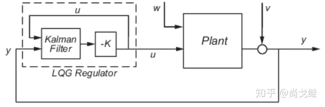
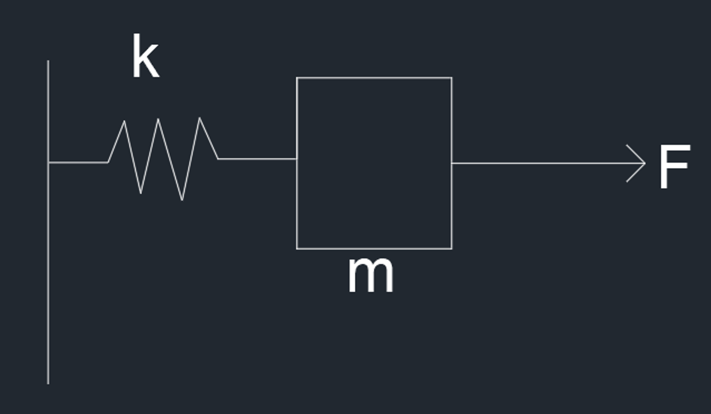

# LQG 线性二次高斯

**Linear Quadratic Gaussian**

在实际系统中，噪声是不可避免的，在噪声的影响下，系统状态方程可以写作

$$
\left\{\begin{aligned}&\dot{X}=AX+Bu+Gw\\&y=CX+Du+Hw+v\end{aligned}\right.
$$

其中 $w,v$ 均被当作为白噪声

如果我们假设噪声是均值为0高斯分布（事实上很多时候确实近似服从高斯分布，想想为什么呢？）由于系统噪声和输出噪声的存在，状态不能完美的衰减为0。我们就希望优化损失函数的期望，即

$$
J=E\{\underset{T\rightarrow\infty}{\lim}\frac{1}{T}\int_0^T[X^TQX+U^TRU]dt\}
$$

LQG 控制器实际上就是一个最优二次型线性调节器+一个最优状态估计器（卡尔曼滤波器）而得到的一个控制器，即 LQR+KF

而 LQG 控制器相当于是将两个系统分离，LQR 与 KF 分离，而 LQR 是依旧是依据原系统所建立的一个控制系统，不过是对应的应该使用 KF 的输出值

### KF

在 LQG 框观测器架中的卡尔曼滤波器，指的是一个最优状态观测器，这里的观测器是现代控制理论—状态空间方程中的最常见的观测器——龙伯格观测器，但是后者极点是自由配置的，并且没有考虑噪声的影响，并不是最优

对于一个系统

$$
\dot{x}=Ax+Bu+Gw\\y=Cx+Du+Hw+v
$$

其中 $w$ 是过程噪声， $v$ 是观测噪声，它们被假设是符合高斯（Gauss）分布的。 $G,H$ 是常系数矩阵，用于描述 $x$ 中各部分受到噪声强度不一致的情况，很多地方 $H$ 被认为是一个 0 矩阵，区别不大 

**假设**

- 系统可观测
- 噪声符合高斯分布，且协方差矩阵为 $E(ww^T)=Q_k,E(vv^T)=R_k,E(wv^T)=N_k$

对于给定观测器动态和代价函数

$$
\dot{\hat x}=A\hat{x}+Bu+L(y-C\hat{x}-Du)\\\hat{y}=\hat{x}\\J'=\underset{t\rightarrow \infty}{\lim}E\{(x-\hat{x})(x-\hat x)^T\}
$$

需要寻找一个常系数矩阵使得 $J'$ 最小，最后得到

$$
L=(PC^T+\overline{N})\overline{R}^{-1}
$$

其中

$$
\overline{R}=R_k+HN_k+N_k^TH^T+HQ_kH^T\\\overline{N}=G(Q_kH^T+N_k)
$$

同时 $P$ 是以下 Riccati 方程的解，并且 $P$ 是一个对称正定矩阵

$$
A^TP+PA-(PB+N_k)R_k^{-1}(B^TP+N_k^T)+Q_k=0
$$

使用得到的这个 $L$ 的最优观测器，就是 LQG 框架使用的卡尔曼滤波器

### LQG



其中的 -K 就是 LQR 控制器，而 w 是过程噪声， v 是观测噪声

### 分离性原理

假设系统可控可观测

LQR 是一种最优的线性状态反馈， KF 是一种最优的状态估计，直接将两级串联闭环系统可以写作

$$
\begin{bmatrix}\dot{x}\\\dot{\hat x}\end{bmatrix}=A_{lqg}\begin{bmatrix}x\\\hat x\end{bmatrix}+G_{lqg}\begin{bmatrix}w\\v\end{bmatrix}\\y=C_{lqg}\begin{bmatrix}x\\\hat x\end{bmatrix}+H_{lqg}\begin{bmatrix}w\\v\end{bmatrix}
$$

其中

$$
A_{lqg}=\begin{bmatrix}A&-BF\\LC&A-BF-LC\end{bmatrix}\\G_{lqg}=\begin{bmatrix}G&0\\LH&L\end{bmatrix}\\B_{lqg}=\begin{bmatrix}B\\B-LD\end{bmatrix}\\C_{lqg}=\begin{bmatrix}C&-DF\\0&0\end{bmatrix}\\H_{lqg}=\begin{bmatrix}H&0\\0&I\end{bmatrix}
$$

此时引入观测器误差 $\delta=x-\hat{x}$，可以得到

$$
\begin{bmatrix}x\\\delta\end{bmatrix}=\begin{bmatrix}I&0\\I&-I\end{bmatrix}\begin{bmatrix}x\\\hat x\end{bmatrix}\\\Downarrow\\\begin{bmatrix}I&0\\I&-I\end{bmatrix}\begin{bmatrix}x\\\delta\end{bmatrix}=\begin{bmatrix}x\\\hat x\end{bmatrix}\\C_{transform}=\begin{bmatrix}I&0\\I&-I\end{bmatrix}
$$

所以带入上式可以得到

$$
\begin{bmatrix}\dot{x}\\\dot{\delta}\end{bmatrix}=C_{transform}A_{lqg}C_{transform}\begin{bmatrix}x\\\delta\end{bmatrix}+C_{transform}G_{lqg}\begin{bmatrix}w\\v\end{bmatrix}\\y=C_{lqg}C_{transform}\begin{bmatrix}x\\\delta\end{bmatrix}+H_{lqg}\begin{bmatrix}w\\v\end{bmatrix}\\\Downarrow\\\begin{bmatrix}\dot{x}\\\dot{\delta}\end{bmatrix}=\begin{bmatrix}A-BF&BF\\0&A-LC\end{bmatrix}\begin{bmatrix}x\\\delta\end{bmatrix}+C_{transform}B_{lqg}\begin{bmatrix}w\\v\end{bmatrix}\\\Downarrow\\\dot{x_a}=A_ax_a+G_aW\\y=C_ax_a+H_aW
$$

由于 $A-BF$ 和 $A-LC$ 都是稳定的，即它们的特征值都严格小于 0，根据分块矩阵的特征值得计算规则，这个大的矩阵也是稳定的。这就意味着可以使 LQR 和 KF 级联，得到一个稳定的系统，这就是分离性原理。

### 例子



由此图列出系统状态方程

$$
\begin{bmatrix}\dot{x_1}\\\dot{x_2}\end{bmatrix}=\begin{bmatrix}0&1\\\frac{k}{m}&0\end{bmatrix}\begin{bmatrix}x_1\\x_2\end{bmatrix}+\begin{bmatrix}0\\\frac{1}{m}\end{bmatrix}u+\begin{bmatrix}1\\1\end{bmatrix}w\\y=\begin{bmatrix}1&0\end{bmatrix}\begin{bmatrix}x_1\\x_2\end{bmatrix}+\begin{bmatrix}0\end{bmatrix}w+v
$$

首先是建立 LQR 控制器，先不考虑噪声

$$
\begin{bmatrix}\dot{x_1}\\\dot{x_2}\end{bmatrix}=\begin{bmatrix}0&1\\\frac{k}{m}&0\end{bmatrix}\begin{bmatrix}x_1\\x_2\end{bmatrix}+\begin{bmatrix}0\\\frac{1}{m}\end{bmatrix}u\\y=\begin{bmatrix}1&0\end{bmatrix}\begin{bmatrix}x_1\\x_2\end{bmatrix}
$$

根据系统代价函数

$$
J=\int^\infty_0[x^TQx+u^TRu]dt
$$

设定相应的权重系数矩阵 Q 和 R，并且在matlab中可以直接调用函数 lqr 来获得对应的线性反馈控制器

```matlab
K = lqr(A, B, Q, R);
```

推导过程可以查看 LQR线性二次调节器

建立 KF 滤波器

$$
\hat{x}_{k|k-1}=F_k\hat{x}_{k-1|k-1}\\P_{k|k-1}=F_kP_{k-1|k-1}F_k^T+Q_k\\K_k=P_{k|k-1}H_k^T(H_kP_{k|k-1}H_k^T+R_k)^{-1}\\\hat{x}_{k|k}=\hat{x}_{k|k-1}+K_k(z_k-H_k\hat{x}_{k|k-1})\\P_{k|k}=(I-K_kH_k)P_{k|k-1}
$$

根据公式，可以得到 $\hat{x}$，然后与 lqr 的线性反馈控制器作用，得到对系统的控制

关于 KF 可以看 卡尔曼滤波