# PID控制理论

完整计算公式

$output = k_p*err_{now} + k_i * \sum_{j=0}^{k} e_j + k_d * (err_{now} - err_{last})$

含义：

- P: $kp * err_{now}$
    
    就是 `kp` 乘以**此次误差**，理论值与当前值的差值，作用是主动减小误差，使测量值主动贴近理论值。但是如果只有P的话，响应可能会非常剧烈，不好把控，P太大会导致超调
    
- I: $ki * \sum_{j = 0}^{k} e_j$
    
    只要存在误差（稳态误差），不论误差有多小，i的输出也会越来越大
    
    作用是消除稳态误差，当系统误差已经接近0时，p 的输出会很小，起不到继续减小误差的作用了，导致误差没有办法减小到0，这个时候就需要用到 I 算法，让误差值不断累积，并且累加到输出中
    
- D: $kd * (err_{now} - err_{last})$
    
    就是 `kd` 乘以**此次误差减上次误差**，如果只有 `P+D`，那相当于是一个弹簧系统，阻尼。当变化越剧烈D的效果就会比较大。可以用来抑制系统过冲，更好的控制在理论值范围内
    

```c
float compute(PID* pid, float real) {
	pid->err = pid->target - real;
	pid->errsum += pid->err;
	limitInRange(&pid->errsum, 2000);
	pid->err_dif = pid->err - pid->err_last;
	pid->err_last = pid->err;
	pid->output = pid->kp * pid->err + pid->ki * pid->err_sum + pid->kd * pid->err_dif;
	limitInRange(&pid->output, pid->limit);
	return pid->output;
}
```

速度控制环一般使用PI控制

### 位置式PID

输出的结果可以直接作为一个控制量，但是有时候需要加一个前馈。因为有误差积分 $\sum{e_i}$，一直累加，也就是当前的输出u(k)与过去的所有状态都有关系，用到了误差的累加值；（误差 $e_i$ 会有误差累加），输出的u(k)对应的是执行机构的实际位置，一旦控制输出出错(控制对象的当前的状态值出现问题 )，u(k)的大幅变化会引起系统的大幅变化。

并且位置式PID在积分项达到饱和时,误差仍然会在积分作用下继续累积，一旦误差开始反向变化，系统需要一定时间从饱和区退出，所以在u(k)达到最大和最小时，要停止积分作用，并且要有积分限幅和输出限幅，所以在使用位置式PID时，一般直接使用PD控制

$output = k_p*err_{now} + k_i * \sum_{j=0}^{k} e_j + k_d * (err_{now} - err_{last})$

```c
float compute(PID* pid, float input) {
	pid->err[0] = pid->target - input;
  pid->accErr += pid->err[0];
  limitInRange(&pid->accErr, pid->accErrLimit);
  pid->output = pid->kp * pid->err[0] + pid->ki * pid->accErr + pid->kd * (pid->err[0] - pid->err[1]);
  pid->err[2] = pid->err[1];
  pid->err[1] = pid->err[0];
  return pid->output;
}
```

### 增量式PID

输出的结果是控制量的增量，控制量是多次计算不断累积出来的结果，增量式pid实际上要根据每次的改变量与上次的改变量的差值来做为 kp 项，只有运行起来的时候 kp 相才有作用。控制量 $output$ 仅与最近3次的采样值有关，容易通过加权处理获得比较好的控制效果，并且在系统发生问题时，增量式不会严重影响系统的工作。

$output_i = k_p * (err_{now} - err_{last}) + k_i * err_{now} + k_d * (err_{now} - 2 * err_{last} + err_{lastlast}) + output_{i - 1}$

```c
float compute(PID* pid, float input) {
	pid->err[0] = pid->target - input;
  pid->output = pid->kp * (pid->err[0] - pid->err[1]) + pid->ki * pid->err[0] + pid->kd * (pid->err[0] - 2 * pid->err[1] + pid->err[2]);
  pid->err[2] = pid->err[1];
  pid->err[1] = pid->err[0];
  limitInRange(&pid->output, pid->limit);
  return pid->output;
}
```

### T形积分PID

跟普通的pid相似，是为了减小积分项所带来的误差和控制的幅度

位置式

$output = k_perr_{now} + \frac{k_i  \sum_{j=0}^{k} e_j}{2} + k_d  (err_{now} - err_{last})$

增量式

$output_i = k_p(err_{now} - err_{last}) + \frac{k_ierr_{now}}{2} + k_d(err_{now} - 2err_{last} + err_{lastlast}) + output_{i - 1}$

```c
float TincCompute(PID* pid, float input) {
  pid->err[0] = pid->target - input;
  float ierr = (pid->err[0] + pid->err[1]) / 2;
  pid->output = pid->kp * (pid->err[0] - pid->err[1]) + pid->ki * ierr + pid->kd * (pid->err[0] - 2 * pid->err[1] + pid->err[2]);
  pid->err[2] = pid->err[1];
  pid->err[1] = pid->err[0];
  limitInRange(&pid->output, pid->outputLimit);
  return pid->output;
}

float TposCompute(PID* pid, float input) {
  pid->err[0] = pid->target - input;
  pid->accErr += (pid->err[0] + pid->err[1]) / 2;
  limitInRange(&pid->accErr, pid->accErrLimit);
  pid->output = pid->kp * pid->err[0] + pid->ki * pid->accErr + pid->kd * (pid->err[0] - pid->err[1]);
  pid->err[2] = pid->err[1];
  pid->err[1] = pid->err[0];
  return pid->output;
}
```

### 不完全微分PID

微分项有引入高频干扰的风险，但若在控制算法中加入低通滤波器，则可使系统性能得到改善。方法之一就是在PID算法中加入一个一阶低通滤波器。这就是所谓的不完全微分，有两种形式，其结构图如下：

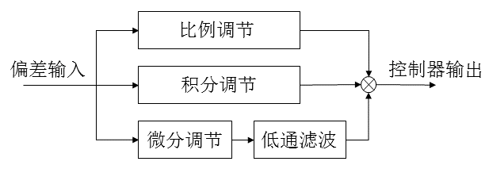

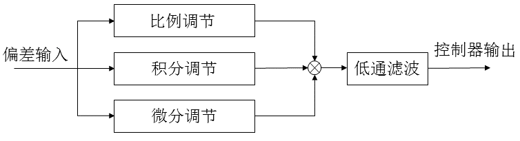

其中微分环节的计算公式为：

- 位置式公式
    
    $U_d(k) = k_d(1-\alpha)(err(k)-err(k-1))+\alpha U_d(k-1)$
    
- 增量式公式：
    
    $\Delta U_d(k) = k_d(1-\alpha)(err(k)-err(k-1))-(1-\alpha)U_d(k-1)$
    
    或者表示为
    
    $\Delta U_d(k) = k_d(1-\alpha)(err(k)-2err(k-1)+err(k-2))+\alpha \Delta U_d(k-1)$
    

```c
typedef struct {
  float real;
  float target;
  float err[3];
 
  float accErr;
  float accErrLimit;

  float ud;
  float deltaud;

  float output;
  float outputLimit;

  float alpha; // 滤波因子
 
  float kp;
  float ki;
  float kd;

}PID;

float posCompute(PID* pid, float input) {
  pid->err[0] = pid->target - input;
  pid->accErr += pid->err[0];
  limitInRange(&pid->accErr, pid->accErrLimit);

  pid->ud = pid->kd * (1 - pid->alpha) * (pid->err[0] - pid->err[1]) + pid->alpha * pid->ud;
  pid->output = pid->kp * pid->err[0] + pid->ki * pid->accErr + pid->ud;

  pid->err[2] = pid->err[1];
  pid->err[1] = pid->err[0];
  
  limitInRange(&pid->output, pid->outputLimit);
	return pid->output;
}

float incCompute(PID* pid, float input) {
  pid->err[0] = pid->target - input;
  
  float deltaud = pid->kd * (1 - pid->alpha) * (pid->err[0] - pid->err[1]) - (1 - pid->alpha) * pid->ud;
  pid->ud += deltaud;
  pid->output = pid->kp * (pid->err[0] - pid->err[1]) + pid->ki * pid->err[0] + pid->ud;

  pid->err[2] = pid->err[1];
  pid->err[1] = pid->err[0];
  
  limitInRange(&pid->output, pid->outputLimit);
	return pid->output;
}

float incCompute(PID* pid, float input) {
  pid->err[0] = pid->target - input;
  
  pid->ud = pid->kd * (1 - pid->alpha) * (pid->err[0] - 2 * pid->err[1] + pid->err[2]) + pid->alpha * pid->deltaud;
  pid->output = pid->kp * (pid->err[0] - pid->err[1]) + pid->ki * pid->err[0] + pid->ud;

  pid->err[2] = pid->err[1];
  pid->err[1] = pid->err[0];
  
  limitInRange(&pid->output, pid->outputLimit);
	return pid->output;
}
```

### 微分先行PID

微分先行PID控制是只对输出量进行微分，而对给定指令不起微分作用，因此它适合于给定指令频繁升降的场合，可以避免指令的改变导致超调过大。微分先行的基本结构图：


根据上面的结构图，我们可以推出PID控制器的输出公式，比例和积分是不变的只是微分部分变为只对输出对象积分。将输出对象记为 $y$ ，对微分部分引入一阶惯性滤波 $\frac{1}{\gamma T_d+1}$，则可记微分部分传递函数为 $\frac{U_d(s)}{Y(s)}=\frac{T_ds+1}{\gamma T_ds+1}$，于是微分部分公式为 $u_d(k)=\frac{\gamma T_d}{\gamma T_d+T}u_d(k-1) + \frac{T_d+T}{\gamma T_d+T}y(k)+\frac{T_d}{\gamma T_d +T}y(k-1)$

由于 $kd = kp \frac{T_d}{T}$，带入其中可得

位置式公式

$u_d(k)=\frac{\gamma k_d}{\gamma k_d+k_p}u_d(k-1) + \frac{k_d+k_p}{\gamma k_d+k_p}y(k)+\frac{k_d}{\gamma k_d +k_p}y(k-1)$

增量式公式

$\Delta u_d(k)=\frac{\gamma k_d}{\gamma k_d+k_p}\Delta u_d(k-1) + \frac{k_d+k_p}{\gamma k_d+k_p}\Delta y(k)+\frac{k_d}{\gamma k_d +k_p}\Delta y(k-1)$

```c
typedef struct {
  float target;
  float err[3];
  float input[2];
  float deltaInput[2];
 
  float accErr;
  float accErrLimit;

  float ud;
  float deltaud;

  float output;
  float outputLimit;

  float gama; // 微分先行滤波系数
 
  float kp;
  float ki;
  float kd;
}PID;

float posCompute(PID* pid, float input) {
  pid->input[0] = input;
  pid->ud = (pid->gama * pid->kd * pid->ud + (pid->kd + pid->kp) * pid->input[0] + pid->kd * pid->input[1]) / (pid->gama * pid->kd + pid->kp);
  pid->input[1] = pid->input[0];
  pid->err[0] = pid->target - input;
  pid->accErr += pid->err[0];
  limitInRange(&pid->accErr, pid->accErrLimit);
  pid->output = pid->kp * pid->err[0] + pid->ki * pid->accErr + pid->ud;
  limitInRange(&pid->output, pid->outputLimit);
  return pid->output;
}
float incCompute(PID* pid, float input) {
  pid->input[0] = input;
  pid->deltaInput[0] = input - pid->input[1];
  pid->deltaud = (pid->gama * pid->kd * pid->deltaud + (pid->kd + pid->kp) * pid->deltaInput[0] + pid->kd * pid->deltaInput[1]) / (pid->gama * pid->kd + pid->kp);
  pid->input[1] = pid->input[0];
  pid->deltaInput[1] = pid->deltaInput[0];
  pid->err[0] = pid->target - input;
  pid->output = pid->kp * (pid->err[0] - pid->err[1]) + pid->ki * pid->err[0] + pid->deltaud;
  limitInRange(&pid->output, pid->outputLimit);
  return pid->output;
}
```

### 积分分离PID

在过程的启动、结束或大幅度增减设定值时，短时间内系统输出有很大偏差，会造成PID运算的积分累积，引起超调或者振荡。为了解决这一干扰，人们引入了积分分离的思想。其思路是偏差值较大时，取消积分作用，以免于超调量增大；而偏差值较小时，引入积分作用，用来消除静差，提高控制精度。

根据实际情况，设定一个阈值；当偏差大于阈值时，消除积分项仅用PD控制；当偏差小于等于阈值时，引入积分采用PID控制。

位置式

$u(k) = \left\{\begin{aligned}&k_p err(k)+k_i\sum^{k}_{j=0}err(j)+k_d(err(k)-err(k-1))&&|err(k)|\leq\epsilon\\&k_p err(k)+k_d(err(k)-err(k-1))&&|err(k)|>\epsilon\end{aligned}\right.$

增量式

$\Delta u(k)=\left\{\begin{aligned}&k_p(err(k)-err(k-1))+k_ierr(k)+k_d(err(k)-2err(k-1)+err(k-2))&&|err(k)|\leq \epsilon\\&k_p(err(k)-err(k-1))+k_d(err(k)-2err(k-1)+err(k-2))&&|err(k)|> \epsilon\end{aligned}\right.$

```c
typedef struct {
  float target;
  float err[3];

  float accErr;
  float accErrLimit;

  float output;
  float outputLimit;

  float inputThreshold;
 
  float kp;
  float ki;
  float kd;
}PID;

float posCompute(PID* pid, float input) {
	pid->err[0] = pid->target - input;
  pid->accErr += pid->err[0];
  limitInRange(&pid->accErr, pid->accErrLimit);
  int kicontrol = 1;
  if(abs(pid->err[0]) > pid->inputThreshold) kicontrol = 0;
  pid->output = pid->kp * pid->err[0] + kicontrol * pid->ki * pid->accErr + pid->kd * (pid->err[0] - pid->err[1]);
  pid->err[2] = pid->err[1];
  pid->err[1] = pid->err[0];
  limitInRange(&pid->output, pid->outputLimit);
  return pid->output;
}
float incCompute(PID* pid, float input) {
	pid->err[0] = pid->target - input;
  int kicontrol = 1;
  if(abs(pid->err[0]) > pid->inputThreshold) kicontrol = 0;
  pid->output = pid->kp * (pid->err[0] - pid->err[1]) + kicontrol * pid->ki * pid->err[0] + pid->kd * (pid->err[0] - 2 * pid->err[1] + pid->err[2]);
  pid->err[2] = pid->err[1];
  pid->err[1] = pid->err[0];
  limitInRange(&pid->output, pid->outputLimit);
  return pid->output;
}
```

### 变速积分PID

在普通的PID控制算法中，由于积分系数ki；是常数，所以在整个控制过程中，积分增量不变。而系统对积分项的要求是，系统偏差大时积分作用应减弱甚至全无，而在偏差小时则应加强。积分系数取大了会产生超调，甚至积分饱和，取小了又迟迟不能消除静差。变速积分PID的基本思想是设法改变积分项的累加速度，使其与偏差大小相对应：偏差越大，积分越慢，反之则越快。主要是为了防止在偏差过大时积分项产生超调，在越接近的时候就产生积分项来消除静态误差，从而更精确的控制系统

位置式：

$u_i(k)=k_i(\sum_{i=0}^{k-1}e(i)+f(e(k))*e(k))$

$u(k)=k_p*err(k)+u_i(k)+k_d*(err(k)-err(k-1))$

增量式：

$\Delta u_i(k)=k_i * f(e(k))*e(k))$

$\Delta u(k)=k_p(err(k)-err(k-1))+u_i(k)+k_d(err(k)-2err(k-1)+err(k-2))$

其中 $f$ 函数可设为

$f(x)=\left\{\begin{aligned}&1&&|x|\leq B\\&\frac{A-|x|+B}{A}&&B<|x|\leq A+B\\&0&&|x|>A+B\end{aligned}\right.$

```c
typedef struct {
  float target;
  float err[3];

  float accErr;
  float accErrLimit;

  float output;
  float outputLimit;

  float ui;
  float deltaui;
 
  float kp;
  float ki;
  float kd;

  float (*func) (float ex);
}PID;

float posCompute(PID* pid, float input) {
	pid->err[0] = pid->target - input;
  pid->accErr += pid->err[0];
  limitInRange(&pid->accErr, pid->accErrLimit);
  pid->ui = pid->ki * (pid->accErr + pid->func(pid->err[0]) * pid->err[0]);
  pid->output = pid->kp * pid->err[0] + pid->ui + pid->kd * (pid->err[0] - pid->err[1]);
  pid->err[2] = pid->err[1];
  pid->err[1] = pid->err[0];
  limitInRange(&pid->output, pid->outputLimit);
  return pid->output;
}
float incCompute(PID* pid, float input) {
	pid->err[0] = pid->target - input;
  pid->deltaui = pid->kp * pid->func(pid->err[0]);
  pid->output = pid->kp * (pid->err[0] - pid->err[1]) + pid->deltaui + pid->kd * (pid->err[0] - 2 * pid->err[1] + pid->err[2]);
  pid->err[2] = pid->err[1];
  pid->err[1] = pid->err[0];
  limitInRange(&pid->output, pid->outputLimit);
  return pid->output;
}
```

### 模糊PID

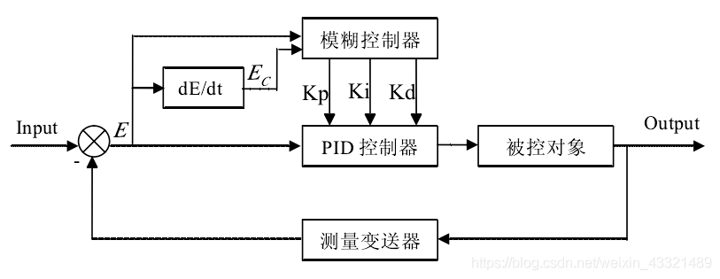

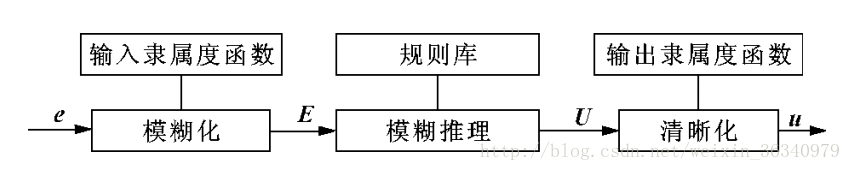


随着自动控制系统被控对象的复杂化，表现为控制系统具有多输入，多输出的强耦合性参数时变性和非线性特性，更突出的问题是从系统获得的信息量相对减少，相反对控制性能得到要求却日益高度化。很多时侯被控对象的精确的数学模型很难或者无法建立。所以可以添加一系列控制规则，再利用模糊理论，模糊语言变量和模糊逻辑推理，将模糊的控制规则上升为数值运算，让计算机实现这些规则，就可以利用计算机模拟人进行自动控制被控对象。

模糊控制系统由模糊数据和规则库，模糊器，模糊推理机和解模糊器组成。并且一般选择 $kp, ki, kd$ 三个系数的增量来作为模糊PID控制的输出值

1. 模糊化——模糊器
    
    模糊化相当于是划定一个范围，对于控制对象的偏转值的范围做一个划分。但是偏差值最终目标是0。误差总会在一定范围内波动，一般来说把这个范围划分为6等分。如果误差不在这个范围内，而在 $[a, b]$ 范围内，就可以使用线性差值将这个误差规定在这个范围内
    
    $err_{now} = \frac{2err_{max}}{b-a}(err_{now} - \frac{a+b}{2})$
    
    | NB | NM | NS | ZO | PS | PM | PB |
    | --- | --- | --- | --- | --- | --- | --- |
    | $-err_{max}$ | $-\frac{2}{3}err_{max}$ | $-\frac{1}{3}err_{max}$ | 0 | $\frac{1}{3}err_{max}$ | $\frac{2}{3}err_{max}$ | $err_{max}$ |
    - N 代表 negative
    - P 代表 positive
    - B big大
    - M middle
    - S small
    - $err_{max}$ 偏差的最大范围
    
    **隶属度**
    
    假设此时的误差为 $-\frac{1}{4}err_{max}$ 那么它相对于 NM 的距离为 $\frac{1}{12}err_{max}$，相对于 NS 的距离为 $\frac{1}{4}err_{max}$，那么对于  PB 的隶属度为 $\frac{1}{12} / \frac{1}{3}= \frac{1}{4}$，相对于 Z0 的隶属度就是 $\frac{1}{4} / \frac{1}{3} = \frac{1}{12}$
    
    于是隶属度曲线关系为
    
    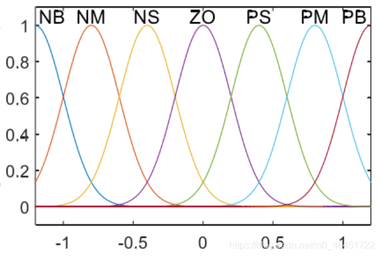
    
    其中利用的是高斯曲线最为隶属度函数的
    
    $f(x,\sigma ,c)= e^{-\frac{(x-c)^2}{2\sigma^2}}$
    
    还可以使用三角形，梯形，S型和Z型作为隶属度曲线。实际上这个影响并不大，而每个模糊子集对整个区域的覆盖范围的大小对性能影响较大，一般来说每个模糊子集的宽度如果选择适当，控制效果就会比较好，如果选择宽度较小，则部分区域没有规则相适应，那么收敛性就不好。
    
    对于误差变化率也可以进行模糊化，规则有两种 **Mamdini** 和 **T-S型模糊控制器**
    
    - Mamdini 型模糊控制器
        
        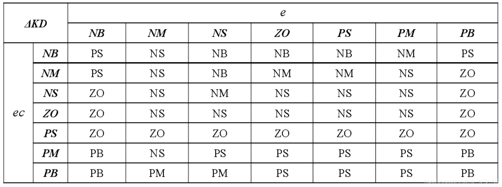
        
        这里的误差变化率为 ec，误差为 e。
        
        在PID中的一般经验是
        
        - 偏差较大时，选用较大的 kp 和较小的 kd 来加快响应，以 kd 为0时来避免积分饱和
        - 当偏差很小时，为了消除稳态误差，克服超调，ki 要稍微加大，而 kd 需要取正值，来做一些抑制
    - T-S型模糊控制器
2. 模糊推理——模糊推理机
3. 去模糊化——解模糊器
    
    对于实际的PID控制需要精确值来做控制，所以需要去模糊化
    
    在实际控制中，每个输入值都会介于两个论阈之间，所以会在规则表中选中一个四格子的矩阵
    
    例子：
    
    |  | NM | NS |
    | --- | --- | --- |
    | PS | ZO | ZO |
    | PM | NS | PS |
    
    假设输入值位于 NM 和 NS 之间，并且输入值的变化量位于 PS 和 PM 之间，则
    
    - E 对于 NM 隶属度为 a，对于 NS 的隶属度为 1-a
    - EC 对于 PS 的隶属度为 b，对于 PM 的隶属度为 1-b
    
    所以有多种解模糊化的算法
    
    - 最大隶属度解模糊法
        
        $output = ZOab + ZOa(1-b)+NS(1-a)b+PS(1-a)(1-b)$
        
    
    除此以外还有面积平分法，面积中心法，加权平均法等方法可以使用。
    
    在模糊PID中一般选择 $kp, ki, kd$ 三个值的增量来作为模糊控制的输出值
    
    下面是经验的三个参数的模糊规则
    
    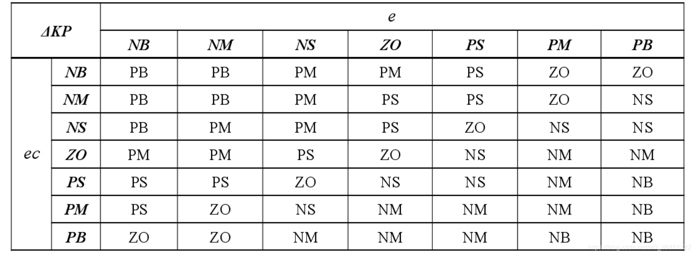
    
    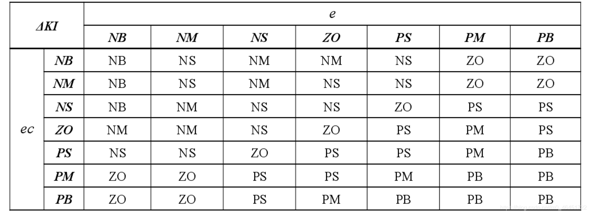
    
    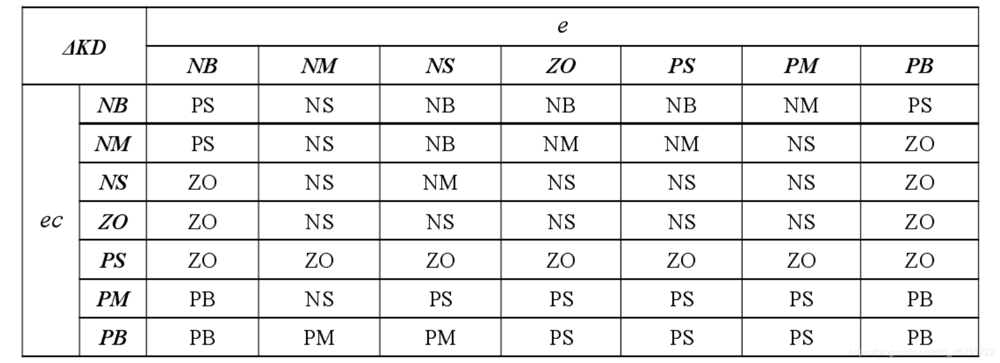
    
    只做了matlab的simulink仿真，效果还不错，是使用的fuzzy插件来实现的，毕竟49个状态量对写代码很不友好

### 专家PID

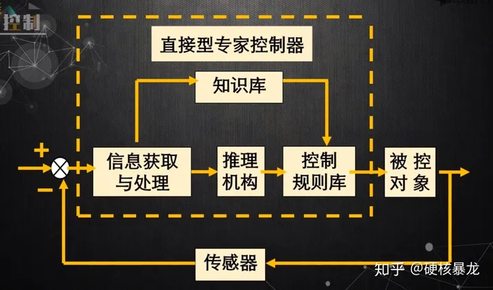

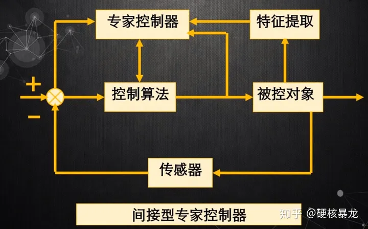

优点：

1. 模型的容量大大扩充，通过不断增删修改规则，可以满足任意动态的控制要求，尤其适用于强干扰，时变的，非线性系统的控制，鲁棒性，自适应性很好。
2. 可以充分利用先验知识。
3. 可以接受定性的描述（可能会需要结合模糊数学的知识）。
4. 可以通过故障检测获得更丰富的知识，进行自我的改善和提升。
5. 长期连续的可靠性。

控制规则

1. 设定误差上限，如果误差值的绝对值已经大于误差上限了，此时直接让控制器满负荷运行
    
    $u(k) = sign(err) * u_{max}$
    
2. 设定误差下限，如果误差存在并且误差正在持续不变或者正在变大，可以控制输出值加上一个增量pid的结果值即 $u(k) = u(k - 1) + k_1(k_p(err(k) - err(k-1)) + k_i * err(k)+ k_d(err(k) - 2err(k-1)+err(k-2))$，实际上是把pid的输出值增大
    
    如果误差值大于误差下限，说明误差值仍然较大，可以将 $k_1$ 增大，反之可以减小
    
3. 当误差存在并且误差值正在减小，可以将输出维持原值 $u(k) = u(k-1)$
4. 当误差存在并且 $\Delta err(k) * \Delta err(k -1) < 0$ 说明此时误差值到了极值，此时输出为 $u(k) = u(k-1)+k_2k_ie(k)$，当误差值大于误差下限，说明误差仍然较大，可以适当的将 $k_2$ 增大，反之减小
5. 设定控制精度，如果误差值在控制精度范围内，就使用 PI 控制，减少稳态误差，此时输出为 $u(k) = u(k-1)+k_ierr(k)+k_p(err(k)-err(k-1))$

### PID的一些缺陷

1. 闭环系统动态品质对PID增益的变化很敏感，如果环境变换，PID控制器的参数需要进行调整；
2. 基于误差消除误差是PID的精髓，但直接取目标与实际之间的差值并不合理，初始误差大会导致初始控制力大，会使系统出现超调（快速性与超调是相互矛盾的），有时也有控制量饱和的问题；
3. 含噪声的信号进行微分难以得到期望的微分信号，PID控制器由于缺少合适的微分器，限制了PID控制的能力；
4. PID中的误差积分，有时会让系统的性能变差。