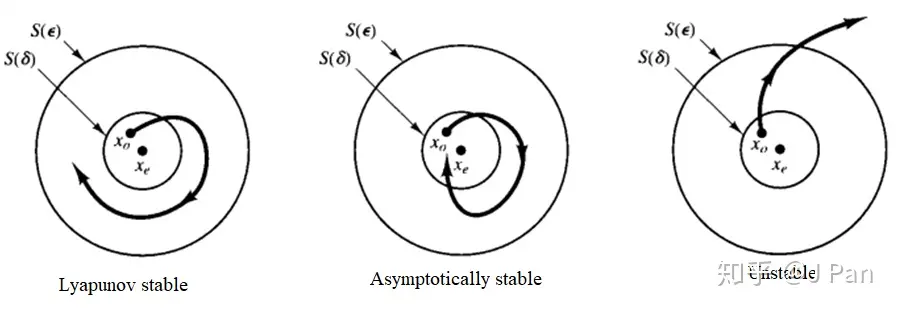
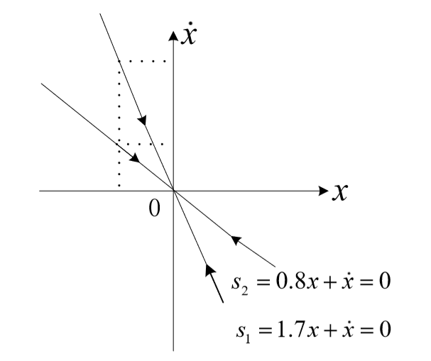
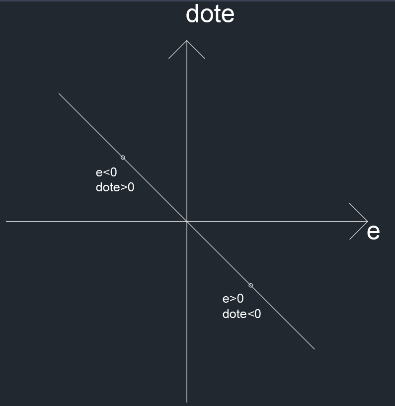

# SMC滑膜控制理论

## 李雅普诺夫**Lyapunov**平衡理论

[李雅普诺夫（第二方法）稳定性](https://blog.csdn.net/sheagu/article/details/108113576)

[如何理解李雅普诺夫稳定性分析](https://zhuanlan.zhihu.com/p/58738073)

主要是用来判断一个系统是否能稳定

### 平衡点

一个控制系统最重要的问题就是稳定性的问题。稳定性就是一个系统在收到扰动之后能否有能力在平衡状态继续工作。平衡点就是系统状态不再发生状态的点，可能不止一个，也可能很脆弱稍微有点扰动就不再平衡了。实际上系统状态稳定的点应该是导数为0的点，也就是让系统状态方程的所有状态的导数为0，即变化率为0。

### 李雅普诺夫稳定

- 如果平衡状态受到扰动之后，仍然停留在平衡状态点附近，即该平衡点在李雅普诺夫意义下是稳定的
- 如果平衡状态受到扰动之后，最终都会收敛到该平衡点处，即该平衡点在李雅普诺夫意义下是渐进稳定的
- 如果平衡状态受到任何扰动之后最终都会收敛到该平衡点处时，即该平衡点咋子李雅普诺夫意义下是大范围渐进稳定的
- 如果平衡状态受到某种扰动之后状态开始偏离平衡点，就称该点在李雅普诺夫意义下是不稳定的
    
    
    

### 李雅普诺夫第一法

需要将非线性系统在平衡态附近线性化，然后讨论线性化系统的特征值分布来研究原非线性系统的稳定性问题。称之为间接法

### 李雅普诺夫第二法

稳定的系统能量总是不断被耗散的，李雅普诺夫通过定义一个标量函数 $V(x)$（通常能代表广义能量）来分析稳定性。这种方法的避免了直接求解方程，也没有进行近似线性化，所以也一般称之为直接法。

如果该标量函数满足：

- $V(x)=0\ if\ and\ only\ if\ x=0$
- $V(x)>0\ if\ and\ only\ if\ x\neq 0$
- $\dot{V(x)}=\frac{d}{dt}V(x)=\sum_{i=1}^{n}\frac{\partial V}{\partial x_i}f(x_i) \leq 0\ when\  x\neq 0$

则该系统在李雅普诺夫意义下是稳定的，特别的，当 $\dot{V(x)}<0$ 则该系统是渐进稳定的

### 优点

在判断一个系统稳定性方面很有用。

### 缺点

很多时候李亚普诺夫函数是凭着经验的猜测。对于一个陌生的控制系统很难构建一个李亚普诺夫函数去证明这个系统的稳定性

## 滑膜控制理论

滑模控制理论（Sliding Mode Control, SMC）是一种建立在现代控制理论基础上的控制理论，主要数学核心为李雅普诺夫函数。滑模控制的核心思想是建立一个滑模面，将被控系统拉取到滑模面上来，使系统沿着滑模面运动。滑模控制的一个优势是无视外部扰动和不确定参数，采用一种比较“暴力”的方式达到控制的目的。

其思想和反步法有些类似，但数学实现起来更加方便而不抽象。相比反步法，滑模控制没有复杂的数学计算，也不会出现“微分爆炸”的问题。但另一方面，滑模控制所采用的控制信号大多是具有正负值反复交替的信号，对于硬件要求很高，一般硬件无法达到这种信号高频来回切换的要求，因此这是滑模控制的一个缺点。
除此之外，信号高频切换所导致的输出信号会出现振荡，系统状态在所选取的滑模面附近来回颤动，这种颤动是无法消除的。这也是滑模控制的一个痛点，目前主流的方法大多是采用滤波、模糊控制、神经网络等方法对震颤进行缓解。

优越性：

- 滑动模态可以进行设计，调节的参数少，响应速度快
- 对扰动不灵敏

滑模控制本质上是非线性控制的一种，简单的说，它的非线性表现为控制的不连续性，即系统的“结构”不固定，可以在动态过程中根据系统当前的状态有目的地不断变化，迫使系统按照预定“滑动模态”的状态轨迹运动。

### 控制设计流程

1. 首先列出系统状态方程
    
    对于一个一阶系统
    
    $\left\{\begin{aligned}\dot{x_1}&=x_2\\\dot{x_2}&=u\end{aligned}\right.$
    
2. 设计滑模面
    
    $s=cx_1+x_2$
    
    设计控制器的目的是为了使 $x_1=0,x_2=0$。当 $s=0$ 时
    
    $\left\{\begin{aligned}cx_1+x2&=0\\\dot{x_1}&=x_2\end{aligned}\right.\Rightarrow cx_1+\dot{x_1}=0\Rightarrow \left\{\begin{aligned}x_1&=x_1(0)e^{-ct}\\x_2&=-cx_1e(0)e^{-ct}\end{aligned}\right.$
    
    可以看出，当 $t→\infty$ 时，状态量都会趋近于0，而且都是以指数的形式趋近的，并且通过调节 c 的大小可以调节状态趋近于0的速度。所以如果满足 $s=cx_1+x_2$，那么系统的状态将沿着滑模面趋近于0。图中就是指状态量都要趋近于0。状态一旦达到滑模面，将以指数的形式趋于稳定
    
    
    
3. 设计趋近律，寻找 $s$ 与u之间的关系
    
    将状态方程带入
    
    $s=cx_1+x_2 \Rightarrow \dot{s}=c\dot{x_1}+\dot{x_2} \Rightarrow \dot{s}=cx_2+u$
    
    这个趋近律就是指 $\dot{s}$，一般来说会有几种设计
    
    $\left\{\begin{aligned}等速趋近律\ \dot{s}&=-\varepsilon * sign(s)&&\varepsilon>0\\指数趋近律\ \dot{s}&=-\varepsilon * sign(s)-k*s&&\varepsilon>0\ k>0\\幂次趋近律\ \dot{s}&=-k|s|^{\alpha}sign(s)&&0<\alpha<1 \\一般趋近律\ \dot{s}&=-\varepsilon * sign(s)-f(s)\end{aligned}\right.$
    
    其中 $sign(x)=\left\{\begin{aligned}1&&s>0\\-1&&s<0\end{aligned}\right.$
    
    就可以求出 $u$ 的值，进而对系统进行控制
    

### 趋近律设计的原因

控制系统中会使用**Lyapunov**函数来判断系统的稳定性，对于系统状态方程 $\dot{s}=cx_2+u$，平衡点为 $s=0$，对于平衡点 $s$，如果存在一个连续函数 $V$ 满足

1. $\lim_{|s|->\infty}V=\infty$
2. $\dot{V}<0\ for s \not= 0$

可以选择 $V(s,t)=\frac{1}{2}s^2$，满足第一条件，对于第二个条件 $\dot{V}=s\dot{s}=-s \varepsilon sign(s)=-\varepsilon |s| < 0$ 满足条件，所以 $s→0$

但是实际上 **Lyapunov** 函数并没有保证趋于平衡的时间，所以对 **Lyapunov** 函数的第二个条件做修改

$\dot{V}\leq -\alpha V^{0.5}$

对第二条件做积分变换 $\int_0^t{\frac{\dot{V}}{V^{0.5}}}dt\leq-\alpha t$ ⇒ $V^{0.5}\leq -\frac{1}{2}\alpha t + V^{0.5}(0)$ ⇒  $t_r\leq\frac{2V^{0.5}(0)}{\alpha}$

最终得到到达稳定状态的时间

同时因为 **Lyapunov** 函数条件发生了改变，控制器也要做出改变

$\left\{\begin{aligned} \dot{V}&=s\dot{s}=-s \varepsilon sign(s)\\V&=0.5s^2\\\dot{V}&\leq -\alpha V^0.5 \end{aligned}\right.$⇒ $\varepsilon \geq \frac{\alpha}{\sqrt{2}}$

所以只有满足最后的条件，才能实现有限时间到达滑模面

### 扰动分析

加入扰动，即 $s=cx_1+x_2 \Rightarrow \dot{s}=c\dot{x_1}+\dot{x_2} \Rightarrow \dot{s}=cx_2+u +d$

控制率依旧保持以上的形式 $u=-cx_2-\varepsilon sign(s)$

带入之后得

$\left\{\begin{aligned} \dot{V}&=s\dot{s}=s(- \varepsilon sign(s)+d)\leq-|s|(\varepsilon -L)\\\dot{V}&\leq -\alpha V^0.5 \end{aligned}\right.$

其中 L 表示干扰的上界，对比的条件，只有满足 $\varepsilon \geq \frac{\alpha}{\sqrt{2}}+L$ 时，**Lyapunov** 函数既满足有限时间收敛又负定。所以系统依旧会先滑动到滑模面，再沿着滑模面做指数级趋近运动，干扰没有影响。

### 缺点

滑膜控制策略与常规控制不同之处在于不连续性，使系统结构随时间变化的开关特性。可以使系统在一定条件下沿着规定的状态轨迹做小幅度高频率的上下运动，这就是滑动模态

仿真实现之后，发现对于一阶和二阶系统来说仿真效果还是很好的，选用指数趋近律会很快接近平衡状态，并且跟踪性很好，但是把曲线放大多倍就会看到系统会有高频震荡，这个对硬件要求很高，所以这个还是不被大量使用的一大缺点，但是可以使用一般趋近律，通过设定一个比较好的 $f(s)$ 来减小这种影响

### 例子

对于一个系统

$$
\dot{x}=ax^2+u=f(x)+u\\x\rightarrow x_d
$$

在先前是设定 $a$ 是一个常数，但在此控制系统中，认为 $a$ 是一个有界（ $|a|\leq |\overline{a}|$，其中 $\overline{a}$ 已知 ）的数，并非是一个常数

系统的目标依旧是 $x→x_d$，设定 $e=x_d-x$，得到 $\dot{e}=\dot{x}_d-\dot{x}=\dot{x}_d-f(x)-u$

引入一个函数 $\rho(x)$（实际上可以是函数，也可以是一个固定的上界）使得 $|f(x)|\leq\rho (x)$，设定

$$
u=\dot{x}_d+ke+\rho(x)\frac{|e|}{e}
$$

**验证**

设置李雅普诺夫函数

$$
V(e)=\frac{1}{2}e^2:PD
$$

则

$$
\dot{V}(e)=e\dot{e}=e(\dot{x}_d-f(x)-u)=e(\dot{x}_d-f(x)-\dot{x}_d-ke-\rho(x)\frac{|e|}{e})\\\Downarrow\\\dot{V}(e)=-ke^2-ef(x)-\rho(x)|e|\leq -ke^2+|e||f(x)|-\rho(x)|e|\leq-ke^2\\\Downarrow\\ \dot{V}(e):ND
$$

所以系统是渐进稳定的

将 $u$ 带入到 $\dot{e}$ 的表达式中，可以看到

$$
\dot{e}=-ke-f(x)-\rho(x)\frac{|e|}{e}
$$

先画出 $\dot{e}=-ke$ 的相平面

可以看到在这个平面山都是向中间原点趋近的，也就是渐进稳定的，所以 $-f(x)-\rho(x)\frac{|e|}{e}$ 就是为了使不在这个平面上的状态进入到这个平面上，这就是**滑膜控制理论**

可以取

$$
u=\dot{x}_d+ke+\frac{|e|}{e}(f(x)+0.1)
$$