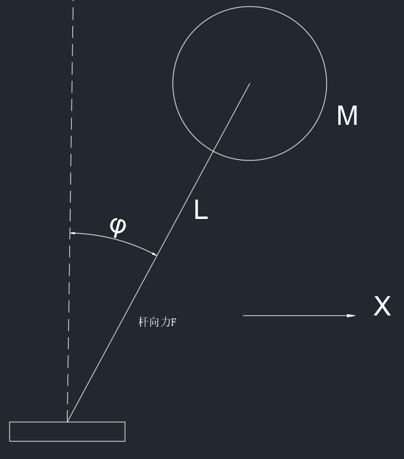

# 线性控制器设计

## 系统控制

对于一个开环控制器来说

$$
\dot{X}=AX
$$

这里的 $A$ 的特征值 $\lambda$ 决定系统的表现，稳定性

当引入一个输入量时，控制器变为

$$
\dot{X}=AX+Bu
$$

其中由于 $u$ 是 $X$ 的函数，所以系统形成了一个闭环控制

对于线性控制器来说，输入 $u$ 满足

$$
u=-KX
$$

代入到控制器中可以得到

$$
\dot{X}=AX-BKX=(A-BK)X
$$

可以选择 $K$ 的数值来使得 $X$ 前的系数的特征值 $\lambda_i$ 处于一个期望的位置上，一般来说，需要保证其特征值均 $≤0$ 才能使得系统稳定

选取 $\lambda_i$ 的原则

- 如果选取 $\lambda$ 为虚数，那么一定会有共轭解存在，将一定会引入一个反复的振动
- $\lambda$ 决定收敛的速度，最后的解的形式会变为 $c_1e^{\lambda_1}+c_2e^{\lambda_2}+...$
- 考虑输入 $u$，有些控制理论中会引入代价函数 $J=\int_0^{\infty}(X^TQX+U^TRU)dt$ ，用于调节参数平衡 u 与系统稳定的关系

控制器设计之前一定要判断一下系统的可控性，一般来说 **先可控，再稳定**

### 一个小栗子

对于一阶倒立摆模型，下面的小块也能移动

当小球在运动中的运动学方程（初始位置为竖直点）

$$
x_{ball}=Lsin(\phi)+x_{block}\rightarrow x_{ball}=L\phi+x_{block}\\y_{ball}=L(1-cos(\phi))=0
$$

小球的动力学方程

$$
F_x=m\ddot{x}_{ball}=Fsin(\phi)=F\phi=ML\ddot{\phi}+m\ddot{x}_{block}\\F_y=Fcos(\phi)=F=Mg
$$

动力学方程化简得到

$$
Mg\phi=ML\ddot{\phi}+M\ddot{x}_{block}\\\Downarrow\\\ddot{\phi}-\frac{g}{L}\phi+\frac{1}{L}\ddot{x}_{block}=0
$$

建立系统状态空间方程，令

$$
X=\begin{bmatrix}x_1\\x_2\end{bmatrix}\\x_1=\phi\\x_2=\dot{\phi}\\u=\frac{1}{L}\ddot{x}_{block}
$$

则从上式可以得到状态空间方程

$$
\dot{X}=\begin{bmatrix}0&1\\\frac{g}{L}&0\end{bmatrix}X+\begin{bmatrix}0\\-1\end{bmatrix}u\\y=\begin{bmatrix}1&0\end{bmatrix}X+[0]u
$$

- 对于开环系统，也就是没有输入 u
    
    $$
    A=\begin{bmatrix}0&1\\\frac{g}{L}&0\end{bmatrix}
    $$
    
    特征值中有一个大于 0 的特征值，不稳定
    
- 对于闭环系统
    
    系统的可控性，由系统的可控性中可知
    
    $$
    Co=\begin{bmatrix}B&AB\end{bmatrix}=\begin{bmatrix}0&-1\\-1&0\end{bmatrix}\\Rank(Co)=2
    $$
    
    所以系统可控，令
    
    $$
    u=-\begin{bmatrix}k_1&k_2\end{bmatrix}X
    $$
    
    带入之后得到
    
    $$
    \dot{X}=\begin{bmatrix}0&1\\\frac{g}{L}+k_1&k_2\end{bmatrix}X=A_dX
    $$
    
    求系数矩阵的特征根
    
    $$
    |\lambda I-A_d|=0\\\Downarrow\\\lambda^2-k_2\lambda-\frac{g}{L}-k_1=0
    $$
    
    为了使得系统稳定，所以一般使其特征根位于负半轴上，所以可以将该式子定义为
    
    $$
    \lambda^2-k_2\lambda-\frac{g}{L}-k_1=0=\lambda^2+2\lambda+1
    $$
    
    得到
    
    $$
    k_1=-1-\frac{g}{L}\\k_2=-2
    $$
    
    带入之后得到
    
    $$
    u=\begin{bmatrix}1+\frac{g}{L}&2\end{bmatrix}X
    $$
    

## 线性控制器——状态跟踪

对于上面所设计的控制器，如果想要使系统状态稳定再某一个位置时，就需要使用状态跟踪了

所以引入一个期望值，这里不对 $x_2$ 进行跟踪

$$
x_{1d}
$$

令

$$
e_1=x_{1d}-x_1\\\\E=\begin{bmatrix}e_1\\x_2\end{bmatrix}
$$

一般来说，系统的期望值是不变的，所以可以得到

$$
\dot{e_1}=-\dot{x}_1
$$

所以可以得到，这里的 $a_{11}$ 是矩阵 A 中的一个元素

$$
\dot{E}=AE+Bu-\begin{bmatrix}0\\a_{11}\end{bmatrix}x_{1d}
$$

可以设计控制器，目的是稳定系统和调整平衡点

$$
u=-KE-B_d^{-1}GX_d
$$

带入得到

$$
\dot{E}=(A_d-B_dK)E
$$

所以需要选择合适的 $K$ 使系统稳定

### 还是上面那个倒立摆的例子

对于上面所设计的控制器，如果想要使系统状态稳定再某一个位置时，就需要使用状态跟踪了

所以引入一个期望值，这里不对 $x_2$ 进行跟踪

$$
x_{1d}
$$

令

$$
e_1=x_{1d}-x_1\\\\E=\begin{bmatrix}e_1\\x_2\end{bmatrix}
$$

一般来说，系统的期望值是不变的，所以可以得到

$$
\dot{e_1}=-\dot{x}_1
$$

对于上面的系统

$$
A=\begin{bmatrix}0&1\\\frac{g}{L}&0\end{bmatrix}\\B=\begin{bmatrix}0\\-1\end{bmatrix}
$$

带入得到

$$
\dot{E}=\begin{bmatrix}0&-1\\-\frac{g}{L}&0\end{bmatrix}E+\begin{bmatrix}0\\-1\end{bmatrix}u+\begin{bmatrix}0\\\frac{g}{L}\end{bmatrix}x_{1d}
$$

所以可以设计

$$
u=-KE+\frac{g}{L}x_{1d}
$$

带入之后得到

$$
A-BK=\begin{bmatrix}0&1\\-\frac{g}{L}+k_1&k_2\end{bmatrix}
$$

求得特征方程为

$$
\lambda^2-k_2\lambda+k_1-\frac{g}{L}=0
$$

令

$$
\lambda^2-k_2\lambda-\frac{g}{L}+k_1=0=\lambda^2+2\lambda+1
$$

得到

$$
k_2=-2\\k_1=1+\frac{g}{L}
$$

也就是

$$
u=\begin{bmatrix}-1-\frac{g}{L}&2\end{bmatrix}E+\frac{g}{L}x_{1d}=-x_{1d}+(1+\frac{g}{L})x_1+2x_2
$$