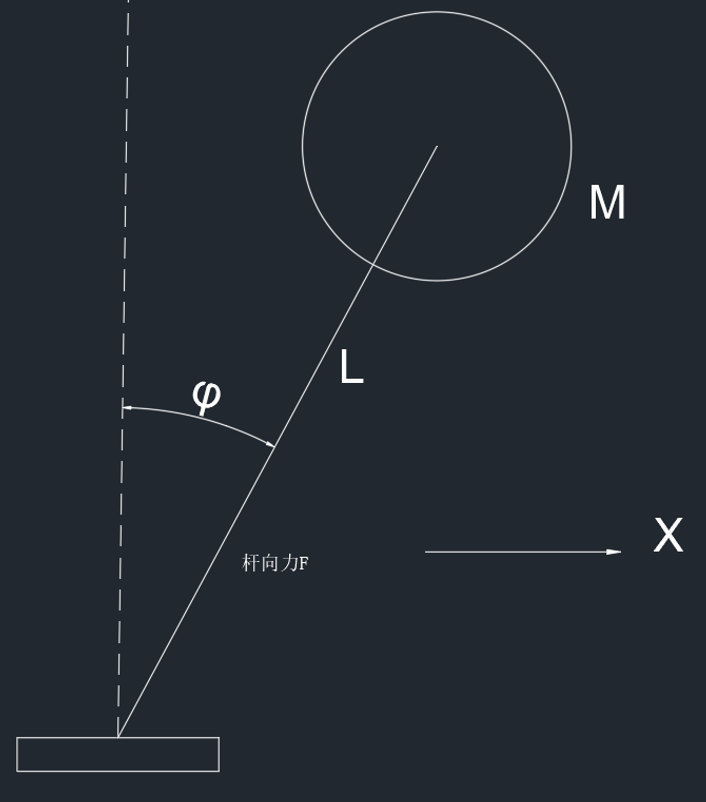

# 系统观测器和控制器结合

对于一个不可观测的系统的控制，就需要用到设计观测器和控制器结合

对于一个系统

$$
\dot{X}=AX+Bu\\y=CX+Du
$$

### 观测器

根据之前的观测器设计，可以得到

$$
\dot{e_x}=(A-LC)e_x\\e_x={X}-{\hat{X}}\\L=\begin{bmatrix}l_1\\l_2\end{bmatrix}
$$

需要 $A-LC$ 的特征值小于 0 ，才能使得该误差值逐渐趋近于 0

### 控制器

其中需要设计控制器为

$$
u=-K\hat{X}
$$

带入到系统状态方程中可以得到

$$
\dot{X}=AX-BK(X-e_x)=(A-BK)X+BKe_x
$$

与观测器中的式子合并可以得到

$$
\begin{bmatrix}\dot{e_x}\\\dot{x}\end{bmatrix}=\begin{bmatrix}A-LC&0\\BK&A-BK\end{bmatrix}\begin{bmatrix}{e_x}\\{x}\end{bmatrix}=M\begin{bmatrix}{e_x}\\{x}\end{bmatrix}
$$

这里就看出来了，M 矩阵的特征值得实部必须小于 0 ，实际上该矩阵的特征值就是 $A-LC$ 和 $A-BK$ 的特征值

最后就是要求观测器的 $A-LC$ 特征值与控制器的 $A-BK$ 的特征值小于 0，它们两个就分离开了

有一个要求就是观测器的收敛速度一定要大于控制器的收敛速度，以此来保证观测到的数据都是较为准确的

一般来说极点位置 $s=-a$ 越小系统收敛越快

## 一个小栗子

建立系统状态空间方程，令

$$
X=\begin{bmatrix}x_1\\x_2\end{bmatrix}\\x_1=\phi\\x_2=\dot{\phi}（不可测）\\u=\frac{1}{L}\ddot{x}_{block}
$$

则从上式可以得到状态空间方程

$$
\dot{X}=\begin{bmatrix}0&1\\\frac{g}{L}&0\end{bmatrix}X+\begin{bmatrix}0\\-1\end{bmatrix}u\\y=\begin{bmatrix}1&0\end{bmatrix}X+[0]u
$$

可以得到

$$
A-LC=\begin{bmatrix}0&1\\\frac{g}{L}&0\end{bmatrix}-\begin{bmatrix}l_1\\l_2\end{bmatrix}\begin{bmatrix}1&0\end{bmatrix}=\begin{bmatrix}-l_1&1\\\frac{g}{L}-l_2&0\end{bmatrix}
$$

可以假设

$$
g=10~N/m^2\\L=1~m
$$

带入后得到

$$
A-LC=\begin{bmatrix}-l_1&1\\10-l_2&0\end{bmatrix}
$$

求其特征方程为

$$
|\lambda I-(A-LC)|=0\\\downarrow\\\lambda^2+l_1\lambda+l_2-10=0
$$

所以，令该特征方程的两个根都为 -1 ，可以得到

$$
l_1=2\\l_2=11
$$

所以带入到估计值的方程中可以得到

$$
\dot{\hat{X}}=(A-LC)\hat{X}+(B-LD)u+Ly\\\Downarrow\\\dot{\hat{X}}=\begin{bmatrix}-2&1\\-1&0\end{bmatrix}\hat{X}+\begin{bmatrix}0\\-1\end{bmatrix}u+\begin{bmatrix}2\\11\end{bmatrix}y
$$

对于线性控制器来说，输入 $u$ 满足

$$
u=-K\hat{X}
$$

$$
\begin{bmatrix}\dot{e_x}\\\dot{x}\end{bmatrix}=\begin{bmatrix}A-LC&0\\BK&A-BK\end{bmatrix}\begin{bmatrix}{e_x}\\{x}\end{bmatrix}=M\begin{bmatrix}{e_x}\\{x}\end{bmatrix}
$$

特征方程为

$$
\lambda^2-k_2\lambda-10-k_1=0
$$

令 $A-BK$ 的特征方程的两个根都为 -1，可以得到

$$
k_1=-11\\k_2=-2
$$

所以得到

$$
u=\begin{bmatrix}11&2\end{bmatrix}\hat{X}
$$