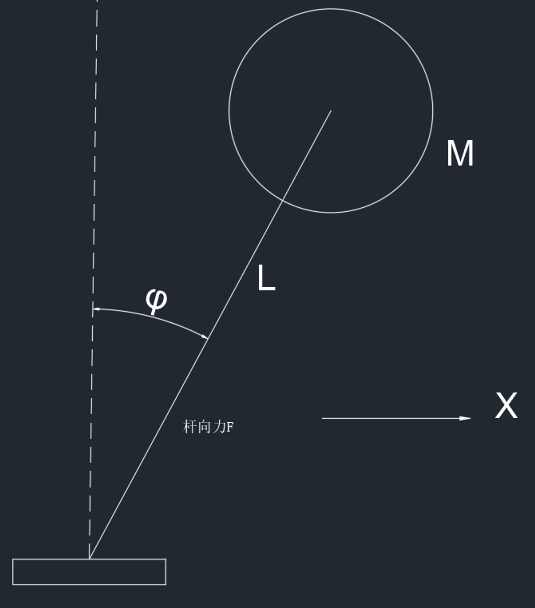

# 线性状态观测器

对于系统的状态，一般都是可以直接测定的，但是有些情况，系统的状态不能够直接测定，所以要根据系统的输入和输出来估计系统的状态

对于一个系统

$$
\dot{X}=AX+Bu\\y=CX+Du
$$

设定 $\hat{X}$ 为系统状态的估计值， $\hat{y}$ 为输出的估计值

$$
\dot{\hat{X}}=A\hat{X}+Bu+L(y-\hat{y})\\\hat{y}=C\hat{X}+Du
$$

两式合并得

$$
\dot{\hat{X}}=(A-LC)\hat{X}+(B-LD)u+Ly
$$

这就是观测器形式

可以得到

$$
\dot{X}-\dot{\hat{X}}=AX+Bu-((A-LC)\hat{X}+(B-LD)u+Ly)\\\Downarrow\\\dot{X}-\dot{\hat{X}}=(A-LC)X-(A-LC)\hat{X}=(A-LC)(X-\hat{X})
$$

此时，令

$$
e_x={X}-{\hat{X}}
$$

是估计值与实际值之间的误差

由于我们的目标肯定是使得实际值与估计值是一致的，所以误差值的期望是变小的，也就是 $e_x→0$

所以根据上式可以得到一个这样的式子

$$
\dot{e_x}=(A-LC)e_x
$$

所以就需要 $A-LC$ 的特征值小于 0 ，才能使得该误差值逐渐趋近于 0

所以需要建立一个新的反馈系统使得 $e_x→0$

所以，令

$$
L=\begin{bmatrix}l_1\\l_2\end{bmatrix}
$$

带入之后选取适当的数值可以使得系统稳定

## 例子

一个倒立摆模型

建立系统状态空间方程，令

$$
X=\begin{bmatrix}x_1\\x_2\end{bmatrix}\\x_1=\phi\\x_2=\dot{\phi}（不可测）\\u=\frac{1}{L}\ddot{x}_{block}
$$

则从上式可以得到状态空间方程

$$
\dot{X}=\begin{bmatrix}0&1\\\frac{g}{L}&0\end{bmatrix}X+\begin{bmatrix}0\\-1\end{bmatrix}u\\y=\begin{bmatrix}1&0\end{bmatrix}X+[0]u
$$

可以得到

$$
A-LC=\begin{bmatrix}0&1\\\frac{g}{L}&0\end{bmatrix}-\begin{bmatrix}l_1\\l_2\end{bmatrix}\begin{bmatrix}1&0\end{bmatrix}=\begin{bmatrix}-l_1&1\\\frac{g}{L}-l_2&0\end{bmatrix}
$$

可以假设

$$
g=10~N/m^2\\L=1~m
$$

带入后得到

$$
A-LC=\begin{bmatrix}-l_1&1\\10-l_2&0\end{bmatrix}
$$

求其特征方程为

$$
|\lambda I-(A-LC)|=0\\\downarrow\\\lambda^2+l_1\lambda+l_2-10=0
$$

所以，令该特征方程的两个根都为 -1 ，可以得到

$$
l_1=2\\l_2=11
$$

所以带入到估计值的方程中可以得到

$$
\dot{\hat{X}}=(A-LC)\hat{X}+(B-LD)u+Ly\\\Downarrow\\\dot{\hat{X}}=\begin{bmatrix}-2&1\\-1&0\end{bmatrix}\hat{X}+\begin{bmatrix}0\\-1\end{bmatrix}u+\begin{bmatrix}2\\11\end{bmatrix}y
$$

## 系统的可观测性

对于一个开环系统

$$
\dot{X}=AX\\y=CX
$$

可以得到系统的状态转移方程

$$
X=e^{At}X(0)
$$

根据状态方程的解，可以知道

$$
y=CX=Ce^{At}X(0)
$$

根据矩阵质数定义的状态转移矩阵有

$$
e^{At}=I+At+\frac{1}{2!}A^2t^2+...
$$

取前 n 项

$$
e^{At}=I+At+\frac{1}{2!}A^2t^2+...+\frac{1}{(n-1)!}A^{n-1}t^{n-1}
$$

带入到上面 y 的式子中

$$
y=(CI+CAt+...+\frac{1}{(n-1)!}CA^{n-1}t^{n-1})X(0)\\=\begin{bmatrix}I&t&...&\frac{1}{(n-1)!}t^{n-1}\end{bmatrix}\begin{bmatrix}C\\CA\\...\\CA^{n-1}\end{bmatrix}X(0)
$$

这是一个非齐次线性方程组，要从上面的式子中唯一的解出 n 阶初始状态 x(0) 的充要条件就是下面这个矩阵为满秩。实际的意义就是**保证从任意状态来说都能推导出一个唯一的初始状态**

定义一个矩阵 O

$$
O=\begin{bmatrix}C\\CA\\...\\CA^{n-1}\end{bmatrix}
$$

**当 $Rank(O)=n$ 就称该系统是可观测的**