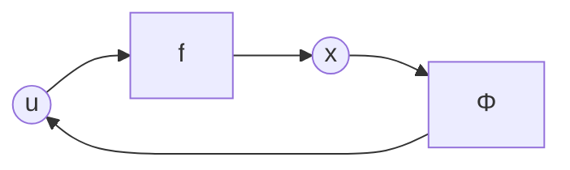

# 非线性系统控制器设计

对于一个非线性系统

$$
\dot{x}=f(x,u)
$$

假设 u 是 x 的函数

$$
u=\phi (x)
$$

所以得到系统状态图

### 反馈线性化

就是将传递函数 $f(x,u)$ 中的非线性部分通过调整 $\phi (x)$ 来抵消，最终得到的是一个线性的关系

**例子**

$$
\dot{x}=f(x,u)=ax^2+u
$$

可以使得 $u=\phi(x)=-ax^2-x$，其中 $-ax^2$ 用于抵消系统的非线性量，而 $-x$ 用于将系统保持平稳，得到

$$
\dot{x}=-x\\\downarrow\\x=e^{-t}
$$

当 $t→\infty$ 时， $x→0$

### 李雅普诺夫直接办法

需要选取李雅普诺夫函数来判断

例子

$$
\dot{x}=f(x,u)=x^2-x^3+u
$$

选定

$$
V=\frac{1}{2}x^2
$$

由于

$$
V(0)=0\\V(x)>0~~x\not=0\\\dot{V}=x^3-x^4+xu
$$

所以就需要设计 u 使 $\dot{V}$ 负定

已知

$$
x^3:非负定\\-x^4:负定
$$

所以就需要选定 u 来消除 $x^3$

可以选择 $u=-x^2-x$，消除非负定项

最终得到 

$$
\dot{x}=-x^3-x
$$

根据仿真的结果，可以看出，设计 $u$ 时一定要慎重考虑能耗和收敛速度的平衡关系

### 反步法

对于一个假定的系统

$$
\dot{x}_1=f_1=x_1^2+x_2\\\dot{x_2}=f_2=x_1+u
$$

由于控制输入并不能直接作用到目标 $x_1$ 上，所以控制时就需要控制 $u\rightarrow\dot{x}_2→x_2→\dot{x}_1→x_1$，但是在设计时需要反过来设计，使之不断地满足李雅普诺夫的渐近稳定条件

**步骤**

1. 设计一个 $x_2\rightarrow x_{2d}$ 使得 $x_1→x_{1d}$
    
    引入一个误差 $e=x_{1d}-x_1$，并且使 $e→0$
    
    需要设计一个李雅普诺夫函数 $V_1(e)=\frac{1}{2}e^2$，是个正定的函数，要想满足**李雅普诺夫渐进稳定的条件**，就保证导数负定就可以了
    
    要使 $\dot{V}_1(e)=e\dot e$ 负定，可以使 $\dot{V}_1(e)=-k_1e^2$，也就是
    
    $$
    \dot{e}=\dot{x}_{1d}-\dot{x}_1=\dot{x}_{1d}-(x_1^2+x_2)=-k_1e
    $$
    
    根据上述假定的系统，要使上一步实现，就需要设定 $x_{2d}$，使该系统有一个这样的表现
    
    $$
    x_{2d}=k_1e+\dot{x}_{1d}-x_1^2
    $$
    
2. 设计 u 使得 $x_2→x_{2d}$
    
    引入一个误差 $\delta=x_{2d}-x_2$，并且使 $\delta→0$，带入到 $\dot{V}_1$ 中得到
    
    $$
    \dot{V}_1=-k_1e^2
    $$
    
    此时设计一个李雅普诺夫函数 $V_2(e,\delta)=V_1(e)+\frac{1}{2}\delta^2$，可知它是一个正定的函数，要想满足**李雅普诺夫渐进稳定的条件**，就保证导数负定就可以了，其中 $x_2=x_{2d}-\delta$
    
    $$
    \dot{V}_2=e\dot{e}+\delta\dot{\delta}=e(\dot{x}_{1d}-x_1^2-(k_1e+\dot{x}_{1d}-x_1^2-\delta))+\delta\dot\delta=-k_1e^2+e\delta+\delta\dot\delta\\\downarrow\\\dot{V}_2=-k_1e^2+\delta(e+\dot\delta)
    $$
    
    所以要使之负定，就需要保证 $e+\dot\delta=-k_2\delta$，带入之后得到
    
    $$
    e+(k_1\dot{e}+\ddot{x}_{1d}-2x_1(x_1^2+x_2)-x_1-u)=-k_2(k_1e+\dot{x}_{1d}-x_1^2-x_2)
    $$
    
    最终得到
    
    $$
    u=e+k_1\dot{e}+\ddot{x}_{1d}-2x_1(x_1^2+x_2)-x_1+k_2(k_1e+\dot{x}_{1d}-x_1^2-x_2)
    $$
    

### 一个反步法控制非线性系统的例子

对于一个非线性弹簧滑块的系统，假设弹簧的力的与拉伸长度的关系为 $F=\alpha x^3$

所以该系统的状态方程为

$$
m\ddot{x}+\alpha x^3=F
$$

系统的输入为 $F$，滑块位移为 $x$，质量为 $m$

规定滑块的目标轨迹为 $x_{1d}$

令

$$
x_1=x\\x_2=\dot{x}
$$

所以得到

$$
\dot{x}_1=x_2~~\textcircled{1}\\\dot{x}_2=-\frac{\alpha}{m}x_1^3+\frac{u}{m}~~\textcircled{2}
$$

所以可以通过控制输入来控制 $\dot{x}_2$ 进而控制 $x_2$，从而控制 $x_1$

引入误差 $e$

$$
e=x_{1d}-x_1~~\textcircled{3}
$$

从而目标变为 $e→0$

求导得到

$$
\dot{e}=\dot{x}_{1d}-\dot{x}_1=\dot{x}_{1d}-x_2~~\textcircled{4}
$$

可以找到一个李雅普诺夫函数 $V(e)$ 使之渐进稳定，从而实现目标，设

$$
V_1(e)=\frac{1}{2}e^2~~\textcircled{5}
$$

$V_1$ 是一个正定的函数，求导得到

$$
\dot{V}_1=e(\dot{x}_{1d}-x_2)~~\textcircled{6}\\\Downarrow\\\dot{x}_{1d}-x_2=-k_1e\\\dot{V}_1=-k_1e^2:ND
$$

根据上述期望，可以设置$x_2$ 的期望值

$$
x_{2d}=\dot{x}_{1d}+k_1e~~\textcircled{7}
$$

所以目标变为 $x_2→x_{2d}$，令

$$
\delta=x_{2d}-x_2~~\textcircled{8}
$$

将 8 带入到 6 中，得到

$$
\dot{V}_1=e(\dot{x}_{1d}-(x_{2d}-\delta))
$$

带入 7 式

$$
\dot{V}_1=-k_1e^2+e\delta~~\textcircled{9}
$$

由于 $\dot{\delta}=\dot{x}_{2d}-\dot{x}_2$，带入 2 式和 7 式，得

$$
\dot{\delta}=\ddot{x}_{1d}+k_1\dot{e}-(-\frac{\alpha}{m}x_1^3+\frac{u}{m})
$$

带入 4 式

$$
\dot{\delta}=\ddot{x}_{1d}+k_1(x_{1d}-x_2)+\frac{\alpha}{m}x_1^3-\frac{u}{m}~~\textcircled{10}
$$

此时就需要 $\delta→0,e→0$，需要找到新的李雅普诺夫函数 $V(e,\delta)$ 使之满足渐进稳定的条件了

$$
V_2=V_1+\frac{1}{2}\delta^2:PD
$$

对上式求导得到

$$
\dot{V}_2=\dot{V}_1+\delta\dot\delta=-k_1e^2+e\delta+\delta\dot\delta=-k_1e^2+\delta(e+\dot\delta)
$$

为使之负定，可以设计使 $e+\dot\delta=-k_2\delta$，带入 10 式得

$$
e+\ddot{x}_{1d}+k_1(x_{1d}-x_2)+\frac{\alpha}{m}x_1^3-\frac{u}{m}=-k_2\delta
$$

最终得到

$$
u=me+m\ddot{x}_{1d}+mk_1(\dot{x}_{1d}-x_2)+\alpha x_1^3+mk_2\delta~~\textcircled{11}
$$

**检验**

将 8 式带入 4 式

$$
\dot{e}=\dot{x}_{1d}-(x_{2d}-\delta)=-k_1e+\delta
$$

将 11 式带入 10 式

$$
\dot{\delta}=-e-k_2\delta
$$

所以得到一个线性关系的系统

$$
\begin{bmatrix}\dot{e}\\\dot{\delta}\end{bmatrix}=\begin{bmatrix}-k_1&1\\-1&-k_2\end{bmatrix}\begin{bmatrix}e\\\delta\end{bmatrix}
$$

可以分析一下系数矩阵的特征值

$$
\lambda_1+\lambda_2=-k_1-k_2 < 0\\\lambda_1\lambda_2=k_1k_2+1 > 0\\\downarrow\\k_1,k_2<0
$$

由于平衡点在零点，而且特征值均小于 0 ，是一个渐近稳定的系统