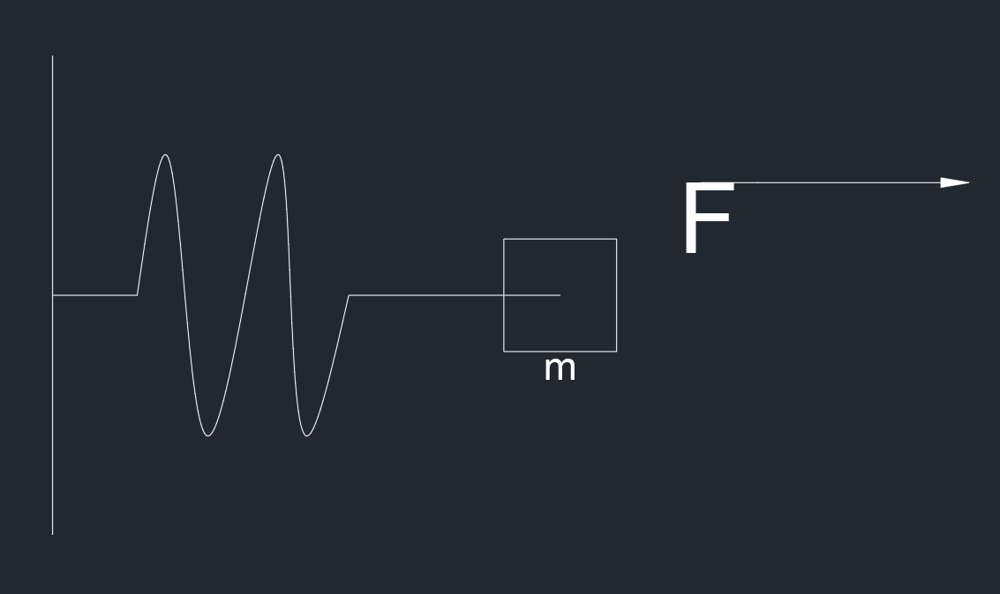

# 非线性自适应控制器

对于一个系统

$$
\dot{x}=ax^2+u\\x\rightarrow x_d
$$

可以设定 $e=x_d-x$，并且使 $e→0$，定义李雅普诺夫函数

$$
V(e)=\frac{1}{2}e^2:PD
$$

得到

$$
\dot{V}(e)=e\dot{e}=e(\dot{x}_d-ax^2-u)
$$

要使得上式负定，可以令 $\dot{e}=-ke$ ，就可以设置 $u=\dot{x}_d-ax^2+ke$，化简上式为

$$
\dot{V}(e)=-ke^2:ND
$$

但是对于上述例子，如果 $a$ 是未知的，或者是缓慢变化的数字（$\dot{a}=0$）就难以控制，所以需要自适应控制器

可以引入估计值 $\hat{a}$ 和估计误差 $\~a=a-\hat{a}$，所以 $\dot{\~a}=\dot{a}-\dot{\hat{a}}=-\dot{\hat{a}}$

所以设置李雅普诺夫函数

$$
V(e,\~a)=\frac{1}{2}e^2+\frac{1}{2}\~a^2
$$

求导得

$$
\dot{V}(e,\~a)=e\dot{e}+\~a\dot{\~a}=e(\dot{x}_d-{a}x^2-u)-\~a\dot{\hat{a}}
$$

所以可以令 $u=\dot{x}_d-\hat{a}x^2+ke$，带入之后得

$$
\dot{V}(e,\~a)=-ke^2-\~a(ex^2+\dot{\hat{a}})\\-ke^2:ND\\-\~a(ex^2+\dot{\hat{a}}):未知
$$

要保证其负定，但是不能保证第二项负定，但是可以令第二项为 0

$$
-\~a(ex^2+\dot{\hat{a}})=0\\\Downarrow\\\dot{\hat{a}}=-ex^2\\\dot{V}(e,\~a)=-ke^2:NSD
$$

引入一个**引理**

$$
\textcircled{1}~V\geq 0\\\textcircled{2}~g(t)\geq 0~~~~\dot{V}\leq -g(t)\\\textcircled{3}~\dot{g}(t)\in L_{\infty}有界\rightarrow g(t)连续\\\Downarrow\\the~\underset{t\rightarrow \infty}{lim}  ~g(t)=0
$$

可以用于验证上式

$$
\textcircled{1}~V\geq 0\\\textcircled{2}~V=-ke^2\leq -(ke^2)=-g(t),g(t)=ke^2\geq 0\\\textcircled{3}~\dot{g}(t)=2ke\dot{e}有界\\\Downarrow\\\underset{t\rightarrow \infty}{lim}  ~g(t)=0\\\Downarrow\\ e\rightarrow 0
$$

由于 $\dot{\hat{a}}=-ex^2 \Rightarrow \hat{a}=-\int_0^{t}ex^2d\tau$ ，可得

$$
u=\dot{x}_d+x^2\int_0^{t}ex^2d\tau +ke
$$

### 一个先前的例子

对于一个非线性弹簧滑块的系统，假设弹簧的力的与拉伸长度的关系为 $F=\alpha x^3$，其中 $\alpha$ 是一个未知数

所以该系统的状态方程为

$$
m\ddot{x}+\alpha x^3=F
$$

系统的输入为 $F$，滑块位移为 $x$，质量为 $m$

规定滑块的目标轨迹为 $x_{1d}$

令

$$
x_1=x\\x_2=\dot{x}
$$

所以得到

$$
\dot{x}_1=x_2~~\textcircled{1}\\\dot{x}_2=-\frac{\alpha}{m}x_1^3+\frac{u}{m}~~\textcircled{2}
$$

所以可以通过控制输入来控制 $\dot{x}_2$ 进而控制 $x_2$，从而控制 $x_1$

引入误差 $e$

$$
e=x_{1d}-x_1~~\textcircled{3}
$$

从而目标变为 $e→0$

求导得到

$$
\dot{e}=\dot{x}_{1d}-\dot{x}_1=\dot{x}_{1d}-x_2~~\textcircled{4}
$$

可以找到一个李雅普诺夫函数 $V(e)$ 使之渐进稳定，从而实现目标，设

$$
V_1(e)=\frac{1}{2}e^2~~\textcircled{5}
$$

$V_1$ 是一个正定的函数，求导得到

$$
\dot{V}_1=e(\dot{x}_{1d}-x_2)~~\textcircled{6}\\\Downarrow\\\dot{x}_{1d}-x_2=-k_1e\\\dot{V}_1=-k_1e^2:ND
$$

根据上述期望，可以设置$x_2$ 的期望值

$$
x_{2d}=\dot{x}_{1d}+k_1e~~\textcircled{7}
$$

所以目标变为 $x_2→x_{2d}$，令

$$
\delta=x_{2d}-x_2~~\textcircled{8}
$$

将 8 带入到 6 中，得到

$$
\dot{V}_1=e(\dot{x}_{1d}-(x_{2d}-\delta))
$$

带入 7 式

$$
\dot{V}_1=-k_1e^2+e\delta~~\textcircled{9}
$$

由于 $\dot{\delta}=\dot{x}_{2d}-\dot{x}_2$，带入 2 式和 7 式，得

$$
\dot{\delta}=\ddot{x}_{1d}+k_1\dot{e}-(-\frac{\alpha}{m}x_1^3+\frac{u}{m})
$$

带入 4 式

$$
\dot{\delta}=\ddot{x}_{1d}+k_1(x_{1d}-x_2)+\frac{\alpha}{m}x_1^3-\frac{u}{m}~~\textcircled{10}
$$

此时就需要 $\delta→0,e→0$，需要找到新的李雅普诺夫函数 $V(e,\delta)$ 使之满足渐进稳定的条件了

$$
V_2=V_1+\frac{1}{2}\delta^2:PD
$$

对上式求导得到

$$
\dot{V}_2=\dot{V}_1+\delta\dot\delta=-k_1e^2+e\delta+\delta\dot\delta=-k_1e^2+\delta(e+\dot\delta)
$$

为使之负定，可以设计使 $e+\dot\delta=-k_2\delta$，带入 10 式得

$$
e+\ddot{x}_{1d}+k_1(x_{1d}-x_2)+\frac{\alpha}{m}x_1^3-\frac{u}{m}=-k_2\delta
$$

最终得到

$$
u=me+m\ddot{x}_{1d}+mk_1(\dot{x}_{1d}-x_2)+\alpha x_1^3+mk_2\delta~~\textcircled{11}
$$

由于上述中 $\alpha$ 未知，所以引入一个预测值 $\hat{\alpha}$ 和预测差值 $\~\alpha=\alpha-\hat{\alpha}\rightarrow0$

设定一个新的李雅普诺夫方程

$$
V_3=\frac{1}{2}e^2+\frac{1}{2}\delta^2+\frac{1}{2}\~\alpha^2:PD
$$

求导得到

$$
\dot{V}_3=e\dot{e}+\delta\dot\delta+\~\alpha\dot{\~\alpha}
$$

并且有

$$
u=me+m\ddot{x}_{1d}+mk_1(\dot{x}_{1d}-x_2)+\hat\alpha x_1^3+mk_2\delta~~\textcircled{11}
$$

带入其中得到

$$
\dot{V}_3=-k_1e^2-k_2\delta^2+\~\alpha(\dot{\hat{\alpha}}+\frac{\delta x_1^3}{m})
$$

已知前两项为负定，不能保证第三项为负定，所以可以使第三项为 0

$$
\dot{\hat\alpha}=-\frac{\delta x_1^3}{m}\\\Downarrow\\\hat{\alpha}=-\int_0^t\frac{\delta x_1^3}{m}dt
$$

则求出 

$$
u=me+m\ddot{x}_{1d}+mk_1(\dot{x}_{1d}-x_2)-x_1^3\int_0^t\frac{\delta x_1^3}{m}dt+mk_2\delta~~\textcircled{11}
$$