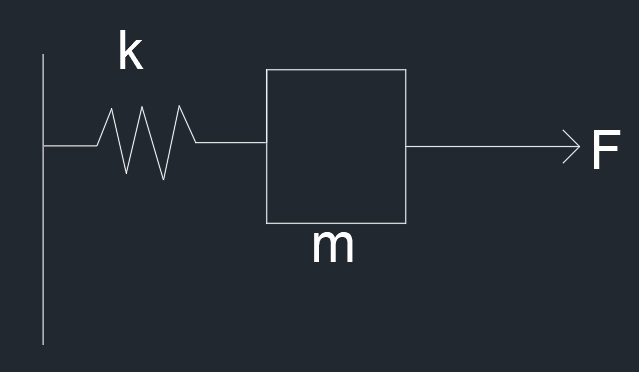

# H∞ 鲁棒控制理论

### 一些定义

首先说明一些定义

$sup$：一个集合最小的上界，不小于它最大值的值，都是它的上界

$inf$：一个集合最大的下界，不大于它最小值的值，都是它的下界

$max$：最大值

$min$：最小值

### 系统的一些性能指标

- **IE 增益**
    
    $$
    \Gamma_{ie}=\underset{w(t)=w_0\delta(t),||w_0||\leq1}{sup}||z||_2
    $$
    
    对于原线性时不变连续时间系统，如果该系统是严格真的（D=0）和渐进稳定（矩阵A特征值均具有负实部）的，那么系统的 **IE 增益**是有限的，并且 $\Gamma_{ie}=\sqrt{||B^TYB||}$，其中矩阵的范数取为谱范数，即矩阵的最大奇异值，例如 A 的谱范数为 $\sqrt{\max(eig(A^TA))}$，其中 $eig$ 表示为取特征值的函数，矩阵 $Y$ 就是以下李雅普诺夫方程的解
    
    $$
    YA+A^TY+C^TC=0
    $$
    
    该定理可以转化为以下的优化问题
    
    $$
    min~\gamma
    $$
    
    其中满足
    
    $$
    \exist P:PD\\PA+A^TP+C^TC<0\\B^TPB\leq\gamma I\\P>0
    $$
    
    该优化问题有一个最优值 $\gamma^*$，则 $\Gamma_{ie}=\sqrt{\gamma^*}$。该优化问题是一个具有线性不等式约束和线性目标函数的凸优化问题，以应用 **LMI 工具箱中的求解器 mincx** 来求解
    
- **EP 增益**
    
    $$
    \Gamma_{ep}=\underset{||w||_2\leq1}{sup}||z||_\infty
    $$
    
    对于原线性时不变连续时间系统，如果该系统是严格真的（D=0）和渐进稳定（矩阵A特征值均具有负实部）的，那么系统的 **EP 增益**是有限的，并且 $\Gamma_{ep}=\sqrt{||CXC^T||}$，其中矩阵的范数取为谱范数，即矩阵的最大奇异值，例如 A 的谱范数为 $\sqrt{\max(eig(A^TA))}$，其中 $eig$ 表示为取特征值的函数，矩阵 $X$ 就是以下李雅普诺夫方程的解
    
    $$
    AX+XA^T+B^TB=0
    $$
    
    该定理可以转化为以下的优化问题
    
    $$
    min~\gamma
    $$
    
    其中满足
    
    $$
    \exist Q:PD\\AQ+QA^T+BB^T<0\\CQC^T\leq\gamma I\\Q>0
    $$
    
    该优化问题有一个最优值 $\gamma^*$，则 $\Gamma_{ep}=\sqrt{\gamma^*}$。该优化问题是一个具有线性不等式约束和线性目标函数的凸优化问题，以应用 **LMI 工具箱中的求解器 mincx** 来求解
    
- **EE 增益**
    
    $$
    \Gamma_{ee}=\underset{||w||_2\leq1}{sup}||z||_2
    $$
    
    定理：对于原线性时不变连续时间系统，设 $\gamma$ 是一个给定的常数，则下列条件是等价的：
    
    1. 系统渐进稳定，且 $\Gamma_{ee}<\gamma$
    2. 存在一个对阵阵 $P>0$，使得
        
        $$
        \begin{bmatrix}A^TP+PA&PB&C^T\\B^TP&-\gamma I&D^T\\C&D&-\gamma I\end{bmatrix}<0
        $$
        
    
    由于条件 2 是一个线性矩阵不等式，因此可以应用 **LMI 工具箱中的求解器 feasp** 来判断系统增益 $\Gamma_{ee}$ 是否满足给定的约束条件。
    
- **PP 增益**
    
    $$
    \Gamma_{pp}=\underset{||w||_\infty\leq1}{sup}||z||_\infty
    $$
    
    定理：对于原线性时不变连续时间系统，设 $\gamma$ 是一个给定的标量，如果存在对称矩阵 $R>0$，标量 $\gamma>0$ 和 $\mu>0$，使得：
    
    $$
    \begin{bmatrix}A^TR+RA+\gamma R&RB\\B^TR&-\mu I\end{bmatrix}<0\\\begin{bmatrix}\gamma R&0&C^T\\0&(\gamma-\mu)I&D^T\\C&D&\gamma^I\end{bmatrix}>0
    $$
    
    那么满足 $\Gamma_{pp}<\gamma$，上述线性矩阵不等式，因此可以应用 **LMI 工具箱中的求解器 feasp** 来判断系统增益 $\Gamma_{ee}$ 是否满足给定的约束条件。
    

## LMI矩阵不等式

### 不确定系统描述


其中有

$$
\left\{\begin{aligned}&\dot{x} = Ax+B_1w+B_2u\\&z = C_1x +D_{11}w+D_{12}u\\&y=C_2x+D_{21}w+D_{22}u\end{aligned}\right.
$$

其中 $C_1, D_{11}, D_{12}, D_{21}, D_{22}$ 是适当维数的矩阵，没有选择标准，要根据实际情况，大量实验选取。 

$P$ 为增广控制对象。

$K$ 是控制器

$u$ 控制输入

$y$ 系统被测量的输出

$w$ 是外部输入或参考的输入，噪声扰动之类的

$z$ 是被控制量的输出，是系统的现时状态

则传递函数为：

$$
U=KY\\Y=G_{21}W+G_{22}U=G_{21}W+G_{22}KY\\Y=(1-G_{22}K)^{-1}G_{21}W\\T_{WZ} = \frac{Z}{W}=G_{11}+G_{12}K(1-G_{22}K)^{-1}G_{21}=F_l(G, K)
$$

则有

1. $H_{\infty}$ 最优控制问题
    
    对于标准鲁棒控制器理论控制框图，寻找一个真实有理的控制器 K，使闭环控制系统稳定，而且最小化闭环传递函数矩阵 $T_{ZW}$ 的 $H_{\infty}$ 范数，即
    
    $$
    \underset {K镇定G}{min}||T_{WZ}(G, K)||_{\infty}
    $$
    
2. $H_{\infty}$ 次最优控制问题
    
    对于标准鲁棒控制器理论控制框图，寻找一个真实有理的控制器 K，使闭环控制系统稳定，而且使闭环传递函数矩阵 $T_{ZW}$ 的 $H_{\infty}$ 范数小于一个给定的常数 $\gamma$ ，即
    
    $$
    ||T_{WZ}(G, K)||_{\infty} < \gamma
    $$
    

### Schur 补性质

给定的对称矩阵

$$
S=\begin{bmatrix}S_{11}&S_{12}\\S_{21}&S_{22}\end{bmatrix}
$$

其中 $S_{11}$ 是 $r\times r$ 维矩阵，所以以下三个条件是等价的

- S < 0，负定
- $S_{11} <0,S_{22}-S_{12}^TS_{11}^{-1}S_{12}<0$
- $S_{22} <0,S_{11}-S_{12}S_{11}^{-1}S_{12}^T<0$

### 系统范数

- 1-范数，信号的时间累计量有界
    
    $$
    \|u\|_1=\int_{-\infty}^{+\infty}|u|dt
    $$
    
- 2-范数，信号的能量有界，平放是对信号能量的一种度量
    
    $$
    \|u\|_2=\sqrt{\int_{-\infty}^{+\infty}|u|^2dt}
    $$
    
- $\infty$-范数，信号的最大幅值有界，真确上界，即连续函数的上界， $\infty$-范数是对信号幅值的度量
    
    $$
    \|u\|_{\infty}=\underset{t\in(-\infty,+\infty)}{ess~sup}|u|<\infty
    $$
    
    sup 表示上确界，ess sup 表示真上确界
    
- 系统的 $H_\infty$ 范数对应 Bode 图中幅值曲线的峰值 $|G(jw)|$，Bode图增益最大值，离原点最大的距离
- 系统的 $H_2$ 范数对应 Bode 图中幅值曲线下方的面积。
- Bode 图横坐标： $w=10^t, L(w)=20lg|G(jw)|$

### 状态反馈 $H_\infty$ 控制

**控制问题的基本框图**


1. **闭环传递函数确定**
    
    考虑线性不变的连续时间系统，存在扰动 $w$
    
    $$
    state:\dot{x}=Ax+B_1w+B_2u\\z=C_1x+D_{11}w+D_{12}u\\y=C_2x+D_{21}w+D_{22}u
    $$
    
    寻找一个控制器 $u=Kx$，使系统保持稳定，将其带入系统中得到
    
    $$
    \dot{x}=Ax+B_1w+B_2u=(A+B_2K)x+B_1w\\z=C_1x+D_{11}w+D_{12}u=(C_1+D_{12}K)x+D_{11}w
    $$
    
    对于系统 $w→z$ 来说，从上式中的到闭环系统传递函数为
    
    $$
    G(s)=C(sI-A)^{-1}B+D\\T_{WZ}(s)=(C_1+D_{12}K)[sI-(A+B_2K)]^{-1}]B_1+D_{11}
    $$
    
2. **状态反馈** $H_\infty$ **控制器**
    
    由于 EE 增益定理，可以得到，给定常数 $\gamma=1$，当且仅当存在一个对称正定矩阵 P，使得
    
    $$
    \begin{bmatrix}(A+B_2K)^TP+P(A+B_2K)&PB_1&(C_1+D_{12}K)^T\\B_1^TP&-I&D_{11}^T\\C_1+D_{12}K&D_{11}&-I\end{bmatrix}<0
    $$
    
    为了求得未知矩阵 $K$ 和 $P$，使用变量替换法，将其转化为一个等价的关于新变量的线性矩阵不等式
    
    首先，分别对其左乘和右乘一个对角阵 $diag\{P^{-1},I,I\}$，则得到
    
    $$
    \begin{bmatrix}P^-1\\&I\\&&I\end{bmatrix}\begin{bmatrix}(A+B_2K)^TP+P(A+B_2K)&PB_1&(C_1+D_{12}K)^T\\B_1^TP&-I&D_{11}^T\\C_1+D_{12}K&D_{11}&-I\end{bmatrix}\begin{bmatrix}P^-1\\&I\\&&I\end{bmatrix}<0\\\Downarrow\\\begin{bmatrix}(AP^{-1}+B_2KP^{-1})^T+(AP^{-1}+B_2KP^{-1})&B_1&(C_1P^{-1}+D_{12}KP^{-1})^T\\B_1^T&-I&D_{11}^T\\C_1P^{-1}+D_{12}KP^{-1}&D_{11}&-I\end{bmatrix}<0
    $$
    
    定义 $X=P^{-1}$ 和 $W=KX$，得到
    
    $$
    \begin{bmatrix}(AX+B_2W)^T+(AX+B_2W)&B_1&(C_1X+D_{12}W)^T\\B_1^T&-I&D_{11}^T\\C_1X+D_{12}W&D_{11}&-I\end{bmatrix}<0
    $$
    
    对于原线性定常系统，存在一个状态反馈 $H_\infty$ 控制器，当且仅当存在一个对称正定矩阵 X 和矩阵 W ( W 不对称正定)，使得上式和 $X>0$ 成立，并且可行解 $X^*$和 $W^*$ 组成的 $u=W^*(X^*)^{-1}x$ 是系统的的一个状态反馈 $H_\infty$ 控制器。该矩阵的不等式是 $X$ 和 $W$ 的一个线性矩阵不等式，可以利用 **LMI 工具箱的求解器 feasp** 来求解
    
3. **状态反馈 $\gamma-$次优 $H_\infty$ 控制器**
    
    对于一个给定的标量 $\gamma >0$，为了求系统的状态反馈 $\gamma-$次优 $H_\infty$ 控制器，由于
    
    $$
    ||T_wz(s)||_\infty<\gamma
    $$
    
    可以得到
    
    $$
    ||\gamma^{-1}T_{wz}(s)||_\infty<1
    $$
    
    也就是
    
    $$
    ||\gamma^{-1}(C_1+D_{12}K)[sI-(A+B_2K)]^{-1}]B_1+D_{11}||_\infty<1
    $$
    
    所以可以通过使用 $\gamma^{-1}C_1,\gamma^{-1}D_{12},\gamma^{-1}D_{11}$来替换先前的 $C_1,D_{12},D_{11}$，解算方法与上述一致。可以得到
    
    $$
    \begin{bmatrix}(AX+B_2W)^T+(AX+B_2W)&B_1&\gamma^{-1}(C_1X+D_{12}W)^T\\B_1^T&-I&\gamma^{-1}D_{11}^T\\\gamma^{-1}(C_1X+D_{12}W)&\gamma^{-1}D_{11}&-I\end{bmatrix}<0
    $$
    
    将上式分别左乘和右乘一个对角矩阵 $diag\{I,I,\gamma I\}$，得到
    
    $$
    \begin{bmatrix}(AX+B_2W)^T+(AX+B_2W)&B_1&(C_1X+D_{12}W)^T\\B_1^T&-I&D_{11}^T\\(C_1X+D_{12}W)&D_{11}&-\gamma^{2}I\end{bmatrix}<0
    $$
    
    存在一个状态反馈 $\gamma-$次优 $H_\infty$ 控制器，当且仅当存在一个对称正定矩阵 X 和矩阵 W ( W 不对称正定)，使得上式和 $X>0$ 成立，并且可行解 $X^*$和 $W^*$ 组成的 $u=W^*(X^*)^{-1}x$ 是系统的的一个状态反馈 $H_\infty$ 控制器。该矩阵的不等式是 $X$ 和 $W$ 的一个线性矩阵不等式，可以利用 **LMI 工具箱的求解器 feasp** 来求解
    
4. 状态反馈最优 $H_\infty$ 控制器
    
    基于状态反馈 $\gamma-$次优 $H_\infty$ 控制器的存在条件，建立一个优化问题
    
    $$
    \min\rho\\\begin{bmatrix}(AX+B_2W)^T+(AX+B_2W)&B_1&(C_1X+D_{12}W)^T\\B_1^T&-I&D_{11}^T\\(C_1X+D_{12}W)&D_{11}&-\rho I\end{bmatrix}<0\\X>0
    $$
    
    该问题是一个具有线性矩阵不等式约束和线性目标函数的凸优化问题，可以应用LMI工具箱的求解mincx来求解。如果该问题有解，就可以得到系统的状态反馈最优 $H_\infty$ 控制器。
    

### 输出反馈 $H_\infty$ 控制

1. **设计思路**
    
    当**系统状态难以测量**时，可以选择输出反馈的控制方式，所以就是设计出一个输出反馈控制器 $u=Ky$ 使得原线性定常系统渐进稳定且闭环传递函数 $||T_{WZ}(s)||_\infty<1$。
    
    首先需要假定 $(A,B_2,C_2)$ 是能稳能检测的， $D_{22}=0$，将 $u=Ky$ 写成状态空间方程的形式
    
    $$
    \dot{\hat x}=A_K\hat{x}+B_Ky\\u=C_K\hat{x}+D_Ky
    $$
    
    其中 $\hat{x}$ 是控制器的状态，而 $A_K,B_K,C_K,D_K$ 是待确定的控制器参数矩阵，将其带入原系统得到新的闭环系统
    
    $$
    \begin{bmatrix}\dot{x}\\\dot{\hat x}\end{bmatrix}=\begin{bmatrix}A+B_2D_KC_2&B_2C_K\\B_KC_2&A_K\end{bmatrix}\begin{bmatrix}x\\\hat{x}\end{bmatrix}+\begin{bmatrix}B_1+B_2D_KD_{21}\\B_KD_{21}\end{bmatrix}w\\z=\begin{bmatrix}C_1+D_{12}D_KC_2&D_{12}C_K\end{bmatrix}\begin{bmatrix}x\\\hat{x}\end{bmatrix}+(D_{11}+D_{12}D_KD_{21})w
    $$
    
    简化为
    
    $$
    \dot{x}_a=A_cx_a+B_cw\\z=C_cx_a+D_cw
    $$
    
    由于 EE 增益定理，可以得到，给定常数 $\gamma=1$，当且仅当存在一个对称正定矩阵 $X_c$，使得
    
    $$
    \begin{bmatrix}A_c^TX_c+X_cA_c&X_cB_c&C_c\\B_c^TX_c&-I&D_c^T\\C_c&D_c&-I\end{bmatrix}<0
    $$
    
2. **消元法设计输出反馈** $H_\infty$ **控制器**
    
    定理：原线性定常系统存在一个输出反馈 $H_\infty$控制器，当且仅当存在两个对称正定矩阵 X，Y ，使得
    
    $$
    1.~\begin{bmatrix}N_0&0\\0&I\end{bmatrix}^T\begin{bmatrix}A^TX+XA&XB_1&C_1^T\\B_1^TX&-I&D_{11}^T\\C_1&D_{11}&-I\end{bmatrix}\begin{bmatrix}N_0&0\\0&I\end{bmatrix}<0\\2.~\begin{bmatrix}N_c&0\\0&I\end{bmatrix}^T\begin{bmatrix}AY+YA^T&YC_1^T&B_1\\C_1Y&- I&D_{11}\\B_1^TC_1&D_{11}^T&- I\end{bmatrix}\begin{bmatrix}N_c&0\\0&I\end{bmatrix}<0\\3.~\begin{bmatrix}X&I\\I&Y\end{bmatrix}\geq 0
    $$
    
    其中， $N_0,N_c$ 分别是以子空间 $ker([C_2~~D_{21}])$ 和 $ker([B_2^T~~D_{12}^T])$ 中任意一组基向量作为列所构成的矩阵。可以使用 **LMI 工具箱的求解器 feasp 来求解**
    
    设计所需要的输出反馈 $H_\infty$ 控制器
    
    - 求解满足以上定理的矩阵 X 和 Y
    - 求解满足 $X-Y^{-1}=X_2X_2^T$ 的矩阵 $X_2\in R^{n\times n_K}$，其中 $n_K$ 可以是矩阵 $X-Y^{-1}$ 的秩
    - 用 X 和 $X_2$ 构造 $X_{c}$
    - 将矩阵 $X_c$ 带入到矩阵不等式 $H_{X_c}+P_{X_c}^TKQ+Q^TK^TP_{X_c}<0$ 中，求解将矩阵变量 K
        
        其中
        
        $$
        A_0=\begin{bmatrix}A&0\\0&0\end{bmatrix},B_0=\begin{bmatrix}B_1\\0\end{bmatrix},C_0=\begin{bmatrix}C_1&0\end{bmatrix}\\\overline{A}=\begin{bmatrix}0&B_2\\I&0\end{bmatrix},\overline{C}=\begin{bmatrix}0&I\\C_2&0\end{bmatrix},\overline{D}_{12}=\begin{bmatrix}0&D_{12}\end{bmatrix},\overline{D}_{21}=\begin{bmatrix}0\\D_{21}\end{bmatrix}\\H_{X_c}=\begin{bmatrix}A_0^TX_{c}+X_cA_0&X_cB_0&C_0^T\\B_0^TX_c&-I&D_{11}^T\\C_0&D_{11}&-I\end{bmatrix}\\P_{X_c}=\begin{bmatrix}\overline{B}^TX_c&0&\overline{D}_{12}^T\end{bmatrix}\\Q=\begin{bmatrix}\overline{C}&\overline{D}_{21}^T&0\end{bmatrix}
        $$
        
3. **输出反馈 $\gamma-$次优 $H_\infty$ 控制器**
    
    对于一个给定的标量 $\gamma>0$，为了求解系统的状态反馈 $\gamma-$次优 $H_\infty$ 控制器，当且仅当存在两个对称正定矩阵 $X,Y$，使得
    
    $$
    1.~\begin{bmatrix}N_0&0\\0&I\end{bmatrix}^T\begin{bmatrix}A^TX+XA&XB_1&C_1^T\\B_1^TX&-\gamma I&D_{11}^T\\C_1&D_{11}&-\gamma I\end{bmatrix}\begin{bmatrix}N_0&0\\0&I\end{bmatrix}<0\\2.~\begin{bmatrix}N_c&0\\0&I\end{bmatrix}^T\begin{bmatrix}AY+YA^T&YC_1^T&B_1\\C_1Y&-\gamma I&D_{11}\\B_1^TC_1&D_{11}^T&-\gamma I\end{bmatrix}\begin{bmatrix}N_c&0\\0&I\end{bmatrix}<0\\3.~\begin{bmatrix}X&I\\I&Y\end{bmatrix}\geq 0
    $$
    
    其中， $N_0,N_c$ 分别是以子空间 $ker([C_2~~D_{21}])$ 和 $ker([B_2^T~~D_{12}^T])$ 中任意一组基向量作为列所构成的矩阵。可以使用 **LMI 工具箱的求解器 feasp 来求解**
    
4. **输出反馈最优** $H_\infty$ **控制器**
    
    基于输出反馈 $\gamma-$次优 $H_\infty$ 控制器存在的条件，建立一个优化问题
    
    $$
    \min\rho\\\begin{bmatrix}N_0&0\\0&I\end{bmatrix}^T\begin{bmatrix}A^TX+XA&XB_1&C_1^T\\B_1^TX&-\rho I&D_{11}^T\\C_1&D_{11}&-\rho I\end{bmatrix}\begin{bmatrix}N_0&0\\0&I\end{bmatrix}<0\\\begin{bmatrix}N_c&0\\0&I\end{bmatrix}^T\begin{bmatrix}AY+YA^T&YC_1^T&B_1\\C_1Y&-\rho I&D_{11}\\B_1^TC_1&D_{11}^T&-\rho I\end{bmatrix}\begin{bmatrix}N_c&0\\0&I\end{bmatrix}<0\\\begin{bmatrix}X&I\\I&Y\end{bmatrix}\geq 0
    $$
    
    该问题是一个具有线性矩阵不等式约束和线性目标函数的凸优化问题，可以应用LMI工具箱的求解mincx来求解。如果该问题有解，就可以得到系统的状态反馈最优 $H_\infty$ 控制器。
    
5. **连续时间系统** $H_\infty$ **控制器综合问题求解器 `hinflmi`**
    
    在 `matlab` 中可以使用 `ltisys` 和 `hinflmi` 函数来求解
    
    ```matlab
    B=[B1 B2];C=[C1;C2];D=[D11,D12;D21,D22];
    gamma;
    G=ltisys(A,B,C,D);
    [gopt,K]=hinflmi(G,[1 1],gamma);
    [Ak,Bk,Ck,Dk]=ltiss(K)
    ```
    
    得到满足 $H_\infty$性能 $\gamma<gamma$ 的一个输出反馈次优 $H_\infty$，如果不填 gamma 参数，获得的是一个最优控制
    
    `hinflmi` 函数的基本用法是 `[gopt,K]=hinflmi(system,[p m])`，通过 `mincx` 来优化系统的 $H_\infty$ 性能指标，其中 `p` 是系统测量输出的个数， `m` 是系统控制输入的个数， `K` 是最优 $H_\infty$ 控制器系统矩阵，可通过 `ltiss` 函数得到其状态空间实现。
    

## 控制器设计

图中的 y 是系统观测量，而 u 是对系统的输入值，K 就是对反馈处理的反馈控制器。要使用两个测量量，即系统加速度和系统的行程，u 是控制系统的加速度来控制系统的，也即这个系统是个二阶系统。当然也可以是一阶系统。对于 w 就是来自于系统外部的输入，例如干扰，噪声和参考信号之类的。对于 z 是一些系统输出的错误信号，可以是真实的也可以是虚拟的，在模型中临时使用来设计控制器， $z=\begin{bmatrix}x\\\ddot{x}\\f\end{bmatrix}$，这里使用的是系统的输出和加速度，还有系统驱动力。当干扰输入到系统中之后，在系统 P 种会将干扰放大，而执行器的目标是使干扰的放大最小化，并且在执行过程中使执行力最小，这就是  $H_{\infty}$ 做的，是一种优化，用于计算控制器以最小化 w 和 z 之间得到增益的过程。当然对于系统的控制不一定每一个状态量都重要，所以给 w 和 z 添加加权因子来设置模型的重要性

## 例子

### 状态反馈控制

对于一个滑块弹簧系统



可以得到系统状态方程，假设力的最终作用在滑块上存在噪声 w，满足条件，定义噪声 $-0.05\leq w\leq 0.05,random$

$$
\begin{bmatrix}\dot{x_1}\\\dot{x_2}\end{bmatrix}=\begin{bmatrix}0&1\\\frac{k}{m}&0\end{bmatrix}\begin{bmatrix}x_1\\x_2\end{bmatrix}+\begin{bmatrix}0\\\frac{1}{m}\end{bmatrix}u+\begin{bmatrix}0\\0\end{bmatrix}w\\z=\begin{bmatrix}1&0\\0&0\end{bmatrix}\begin{bmatrix}x_1\\x_2\end{bmatrix}\\y=\begin{bmatrix}1&0\\0&0\end{bmatrix}\begin{bmatrix}x_1\\x_2\end{bmatrix}+\begin{bmatrix}0\\0\end{bmatrix}w
$$

$$
\dot{x}=Ax+B_1w+B_2u\\z=C_1x\\y=C_2x+D_{21}w
$$

将 $u=Kx$ 带入其中，得到

$$
\dot{x}=(A+B_2K)x+B_1w\\z=C_1x\\y=C_2+D_{21}w
$$

得到传递函数 

$$
T_{WZ}(s)=C_1[sI-(A+B_2K)]^{-1}B_1
$$

根据之前的过程可以得到

$$
\begin{bmatrix}(AX+B_2W)^T+(AX+B_2W)&B_1&(C_1X)^T\\B_1^T&-I&0\\C_1X&0&-I\end{bmatrix}<0
$$

当且仅当存在一个对称正定矩阵X和矩阵W(W不对称正定)，使得上述不等式和 $X>0$ 成立，并且得到控制器 $u=W^*(X^*)^{-1}x$ 是系统的一个状态反馈控制器

$$
\begin{bmatrix}(AX+B_2W)^T+(AX+B_2W)&B_1&(C_1X+D_{12}W)^T\\B_1^T&-I&D_{11}^T\\(C_1X+D_{12}W)&D_{11}&-\gamma^{2}I\end{bmatrix}<0
$$

系统次优 $H_\infty$ 控制器

$$
\min\rho\\\begin{bmatrix}(AX+B_2W)^T+(AX+B_2W)&B_1&(C_1X+D_{12}W)^T\\B_1^T&-I&D_{11}^T\\(C_1X+D_{12}W)&D_{11}&-\rho I\end{bmatrix}<0\\X>0
$$

系统最优 $H_\infty$ 控制器

设定 $k=1,m=1$，并将其放入matlab中求解

### 参考文章

鲁棒控制-线性矩阵不等式处理方法——俞立

[H∞(H无穷)滤波器（H-infinity filter）](https://zhuanlan.zhihu.com/p/385669774)

[H无穷控制学习笔记——H无穷控制-CSDN博客](https://blog.csdn.net/weixin_45454343/article/details/114443288)